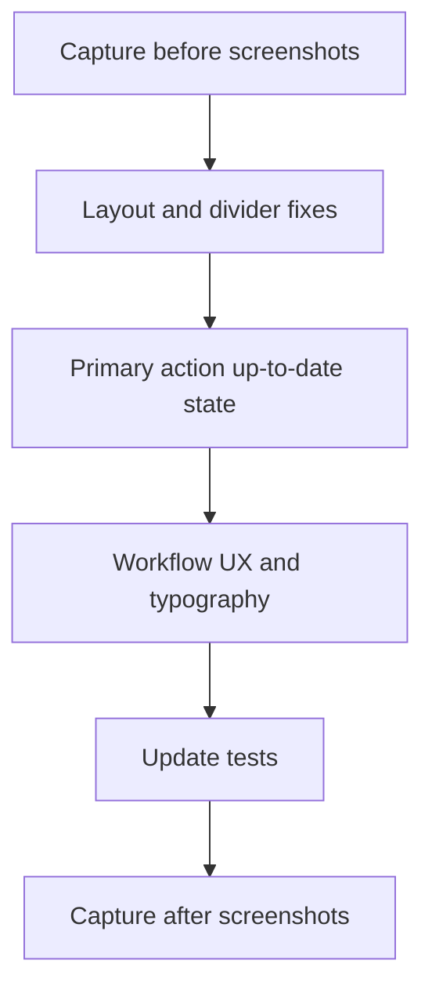

# Changes Panel Polish — Before/After Evidence

## Execution order (strict)

**Step 0 must run on the current branch before any UI edits.**

---

## Phase 0 — Capture “before” evidence

Harden and run [`scripts/capture-changes-panel-states.mjs`](scripts/capture-changes-panel-states.mjs):

- Add `--phase before|after` flag; write to [`.impeccable/evidence/changes-panel/before/`](.impeccable/evidence/changes-panel/before/) and `.../after/`.
- Fix harness reliability:
  - Wait 10s after load; open chat via UI; submit via composer (proven flow).
  - **Git re-seed:** use `rm -rf` + fresh temp dir per dirty/bulk scenario (avoid `git commit` on dirty tree).
  - **Mock patch:** merge into existing `sourceControl` namespace (don’t replace the whole object).
- Add `package.json` script: `capture:changes-panel` → `node --import tsx scripts/capture-changes-panel-states.mjs --phase <before|after>`.
- Viewport: **1920×2032**; panel screenshot via `[data-testid="workspace-panel-changes"]`.

**Scenarios to capture (7):**

| File | State |
|------|-------|
| `01-clean-collapsed.png` | Clean tree, workflows collapsed |
| `02-clean-all-expanded.png` | Clean tree, all 3 workflows expanded (divider stress test) |
| `03-dirty-files.png` | Mixed staged/unstaged/untracked |
| `04-bulk-selection.png` | Dirty + 2 files selected |
| `05-linked-pr-history.png` | Linked PR + History expanded |
| `06-merge-conflict.png` | Merge conflict banner + conflict entries |
| `07-no-git.png` | Initialize repository empty state |

Add [`.impeccable/evidence/changes-panel/README.md`](.impeccable/evidence/changes-panel/README.md) listing scenarios and capture command.

---

## Phase 1 — Layout and vertical space

**Goal:** Empty file area stays compact; commit strip shrinks to content; workflow region earns remaining height.

### CSS — [`src/renderer/styles.css`](src/renderer/styles.css)

- **File region** (`.changes-panel__sections`):
  - Switch from `display: grid` + `flex: 1 1 auto` to `flex: 1 1 auto; min-height: 0; overflow-y: auto; display: flex; flex-direction: column`.
  - Add modifier `.changes-panel__sections--empty { flex: 0 0 auto; min-height: 0; }` when no entries and no conflict.
- **Empty state** (`.changes-panel__empty--inline`): reduce padding (`0.5rem 0.875rem`); no min-height growth.
- **Commit strip** (`.changes-panel__commit-strip`):
  - Add `.changes-panel__commit-strip--compact` modifier: `flex: 0 0 auto; grid-template-rows: 0.625rem auto; min-height: unset` (content-driven height).
  - Keep resize handle + stored height when user has resized (existing layout persistence).
- **Workflow region** (`.changes-panel__secondary`):
  - `flex: 1 1 auto; min-height: 0; overflow-y: auto; display: flex; flex-direction: column`.
  - Expanded section: `flex: 1 1 auto; min-height: 0` with block content `flex: 1 1 auto; min-height: 0; overflow: auto` capped by `--changes-panel-workflow-block-height`.

### TS — [`src/renderer/changes-panel/ChangesPanel.tsx`](src/renderer/changes-panel/ChangesPanel.tsx)

- Apply `changes-panel__sections--empty` when `status?.entries.length === 0 && !conflict`.
- Apply `changes-panel__commit-strip--compact` when no staged/unstaged entries and no inline commit feedback/errors showing.

### Layout constants — [`src/renderer/changes-panel/changes-panel-layout.ts`](src/renderer/changes-panel/changes-panel-layout.ts)

- Lower `COMMIT_SECTION_DEFAULT_HEIGHT` (156 → ~112) and `COMMIT_SECTION_MIN_HEIGHT` (118 → ~96) for compact default.

---

## Phase 2 — Divider deduplication

**Root cause:** three overlapping separators — resize-handle `::before`, expanded header `border-bottom`, collapsed section `border-top` ([`styles.css` ~2220–2234](src/renderer/styles.css)).

**Fix (single rule per boundary):**

1. **Remove** `border-top` from collapsed `.changes-panel__workflow-section`.
2. **Remove** `border-bottom` from expanded workflow section headers.
3. **Keep** resize-handle `::before` as the only visible rule between zones.
4. **Commit ↔ workflows boundary:** keep commit-strip top resize handle only; remove any redundant `border-bottom` on bulk bar when adjacent to handle (audit `.changes-panel__bulk`).

Update [`tests/renderer/styles-audit.test.ts`](tests/renderer/styles-audit.test.ts) workflow assertions to match new flex model (`flex`/`min-height: 0` instead of `grid-auto-rows: max-content` only).

---

## Phase 3 — Primary action / PR duplication

Per decision: **when clean and up-to-date, show a disabled neutral primary “Up to date”**; Create PR only in the ⋯ menu and Pull request section.

### [`src/renderer/changes-panel/source-control-primary-action-resolver.ts`](src/renderer/changes-panel/source-control-primary-action-resolver.ts)

- Add `upToDate` to `SourceControlPrimaryActionId` + `ACTION_LABELS`.
- Change default primary (currently `createPullRequest` at line 194) to `upToDate` when synced (`hasUpstream && ahead === 0 && behind === 0`, no conflicts, no stageable work).
- Keep `createPullRequest` in dropdown only; `onCreatePullRequestRequested` still fires from dropdown selection.

### [`src/renderer/changes-panel/ChangesPanel.tsx`](src/renderer/changes-panel/ChangesPanel.tsx) — `SourceControlActions`

- Handle `upToDate` in `runAction` as no-op.
- Render primary button disabled with label **“Up to date”** (no title/tooltip error).

### Tests

- [`tests/renderer/source-control-primary-action-resolver.test.ts`](tests/renderer/source-control-primary-action-resolver.test.ts): synced branch expects `upToDate`, not `createPullRequest`.
- [`tests/renderer/changes-panel.test.tsx`](tests/renderer/changes-panel.test.tsx): rewrite “creates PR from primary when title filled” → create via PR section only; add test that synced clean tree shows **“Up to date”** primary.

---

## Phase 4 — Workflow UX and typography

### History refresh in collapsed header

- Extend [`WorkflowCollapsibleSection.tsx`](src/renderer/changes-panel/WorkflowCollapsibleSection.tsx) with optional `headerAside?: ReactNode`.
- In [`ChangesPanel.tsx`](src/renderer/changes-panel/ChangesPanel.tsx), pass History refresh icon button into section header (visible collapsed + expanded).
- Remove duplicate toolbar row from embedded [`GitHistoryPanel.tsx`](src/renderer/changes-panel/GitHistoryPanel.tsx) when `embedded` (refresh lives in section header).

### History list density

In [`GitHistoryPanel.tsx`](src/renderer/changes-panel/GitHistoryPanel.tsx) + CSS:

- Subject: `type-caption` weight 500 (not `type-body`).
- Refs: render as compact chips; show max 2 refs + `+N` overflow with `title` for full list.
- Meta line: keep single caption row.

### Loading states

- Replace bare “Loading history…” / upstream loading with **2–3 skeleton rows** (`.changes-panel__skeleton-row`) in history; upstream summary shows “Checking upstream…” with muted pulse bar.
- Respect `prefers-reduced-motion` (instant/no animation).

### Remote summary visibility

- Move upstream summary (`origin/main · N↑ N↓`) adjacent to primary actions row (same line, trailing ellipsis) instead of orphaned below.

---

## Phase 5 — Verification

1. `pnpm test -- tests/renderer/changes-panel.test.tsx tests/renderer/source-control-primary-action-resolver.test.ts tests/renderer/git-history-panel.test.tsx tests/renderer/styles-audit.test.ts`
2. `pnpm lint` + `pnpm typecheck` on touched files.
3. **Capture after:** `pnpm capture:changes-panel --phase after`
4. Compare `before/` vs `after/` pairs; confirm:
   - No double dividers between expanded workflows
   - Compact empty file region on clean state
   - “Up to date” primary (not “Create PR”) when synced
   - History refresh visible on collapsed History header
   - Dirty/bulk/conflict states still readable

---

## Files touched (summary)

| Area | Files |
|------|-------|
| Evidence | `scripts/capture-changes-panel-states.mjs`, `.impeccable/evidence/changes-panel/**`, `package.json` |
| Layout/CSS | `src/renderer/styles.css` |
| Panel logic | `src/renderer/changes-panel/ChangesPanel.tsx`, `WorkflowCollapsibleSection.tsx`, `changes-panel-layout.ts` |
| Actions | `src/renderer/changes-panel/source-control-primary-action-resolver.ts` |
| History | `src/renderer/changes-panel/GitHistoryPanel.tsx` |
| Tests | `tests/renderer/changes-panel.test.tsx`, `source-control-primary-action-resolver.test.ts`, `git-history-panel.test.tsx`, `styles-audit.test.ts` |
