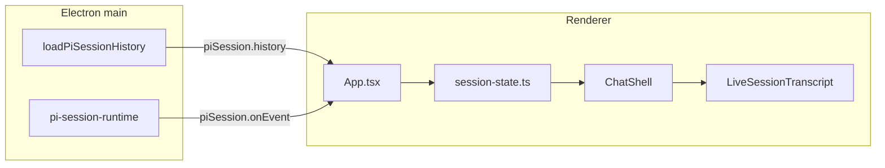

# M05: Chat Transcript Rendering

## Goal

Bring the main chat transcript to production quality for real Pi sessions. **Do not rebuild** session plumbing (`LiveSessionState`, `piSession.onEvent`, `loadPiSessionHistory`, IPC)—this milestone is fit, finish, and readable output on top of M03/M04.

**Source of truth:** [docs/superpowers/specs/2026-05-12-pi-desktop-high-level-roadmap.md](docs/superpowers/specs/2026-05-12-pi-desktop-high-level-roadmap.md) (M05 section, ~L301–342).

**Constraint:** Keep custom session state per [docs/adr/0001-keep-custom-pi-session-chat-state.md](docs/adr/0001-keep-custom-pi-session-chat-state.md)—no `@ai-sdk/react` `useChat`.

---

## Current architecture (keep)

| Area | Location | Notes |
|------|----------|-------|
| Live transcript | [`src/renderer/components/live-session-transcript.tsx`](src/renderer/components/live-session-transcript.tsx) | Plain `{message.content}` + `pre-wrap` CSS |
| Layout router | [`src/renderer/components/chat-shell.tsx`](src/renderer/components/chat-shell.tsx) | `chat-shell--start` vs `chat-shell--session`; scroll in `.chat-shell__scroll` |
| History hydrate | [`src/renderer/App.tsx`](src/renderer/App.tsx) L413–467 | No loading flag; scope mismatch shows empty `createInitialSessionState()` |
| History load (main) | [`src/main/pi-session/pi-session-history.ts`](src/main/pi-session/pi-session-history.ts) | Flat strings; bash/tool/compaction already mapped |
| Static fixture | [`src/renderer/chat/static-transcripts.ts`](src/renderer/chat/static-transcripts.ts) | Only `chat:milestone-01` → `continued-chat` + [`ChatTranscript`](src/renderer/components/chat-transcript.tsx) |

---

## Implementation phases

### Phase 1: History hydration UX (unblocks empty flash)

**Problem:** On chat switch, [`App.tsx`](src/renderer/App.tsx) resets to `createInitialSessionState()` until `piSession.history` returns; [`ChatShell`](src/renderer/components/chat-shell.tsx) shows “No messages yet.” for resumed chats.

**Approach:**

1. Add a small renderer-side hydration state (prefer **separate** from `LiveSessionState` to avoid polluting the reducer):
   - e.g. `TranscriptHydrationState`: `{ chatId, projectId, status: 'idle' | 'loading' | 'loaded' | 'error', errorMessage? }`
   - Set `loading` when `selectedChat.sessionPath` is set and history fetch starts; clear/reset on chat switch (reuse existing `nextHistoryRequestIdRef` cancel pattern).
2. Pass `hydration` into `ChatShell` / `LiveSessionTranscript`.
3. In `chat-shell__scroll`, when `sessionPath` chat is loading, show a centered loading row (spinner + “Loading conversation…”) instead of empty state.
4. On history error, show inline error in scroll (reuse status message pattern or dedicated transcript error block).

**Files:** `App.tsx`, `chat-shell.tsx`, `live-session-transcript.tsx` (or thin `TranscriptPlaceholder`), optional `src/renderer/session/transcript-hydration.ts`, unit tests for hydration + shell branches.

---

### Phase 2: Unified session layout

**Problem:** First prompt from a draft uses centered [`ChatStartState`](src/renderer/components/chat-start-state.tsx); resumed chats use `chat-shell--session`. Roadmap wants one coherent transcript column in `chat-shell__scroll`.

**Approach:**

1. **Chats with `sessionPath`:** Always route to `chat-shell--session` (header + scroll + bottom composer)—never `ChatStartState`.
2. **Draft / new chats:** On first submit (`status` leaves `idle` or `messages.length > 0`), switch to session layout immediately; do not wait for history.
3. Remove dead path: `ChatStartState`’s optional `LiveSessionTranscript` below suggestions (unreachable today because parent only mounts start state when `!hasLiveSession`).
4. Adjust [`createChatShellRoute`](src/renderer/chat/chat-view-model.ts): `empty-chat` with `sessionPath` should behave like a session chat (title + labels), not start-state with `resumeLabel === "Start session"` unless truly empty draft.

**Acceptance tie-in:** Follow-up prompts and resumed history share the same scroll region and bottom composer.

**Files:** `chat-view-model.ts`, `chat-shell.tsx`, `chat-start-state.tsx`, `styles.css` (`chat-shell--session` / scroll padding), update [`tests/renderer/chat-shell.test.ts`](tests/renderer/chat-shell.test.ts) and [`tests/renderer/chat-view-model.test.ts`](tests/renderer/chat-view-model.test.ts).

---

### Phase 3: Markdown rendering

**Problem:** Assistant replies show raw `#`, `` ` ``, etc. ([`.live-session__message-content`](src/renderer/styles.css) uses `white-space: pre-wrap`).

**Approach:**

1. Add dependencies: `react-markdown`, `remark-gfm`, `rehype-sanitize` (no markdown lib in [`package.json`](package.json) today; `pi-web-ui` uses Lit `markdown-block`—not reusable in React renderer).
2. New component: `src/renderer/components/message-content.tsx` (or `markdown-message-content.tsx`):
   - Props: `content`, `streaming`, `variant: 'assistant' | 'user' | 'tool' | 'system'`
   - **Assistant:** full GFM markdown + sanitize; preserve streaming cursor after rendered block.
   - **User:** lighter treatment—`remark-gfm` optional; at minimum preserve line breaks; roadmap allows “equivalent” readability (can start with markdown for both).
   - **Streaming:** Re-render on each delta (existing reducer already updates `content`); avoid layout thrash (stable wrapper, `overflow-wrap: anywhere`).
3. Replace raw `{message.content}` in `LiveSessionTranscript`.
4. Add transcript typography tokens in `styles.css`: headings, lists, `pre`/`code`, blockquotes, links (`target="_blank"`, `rel="noreferrer"`), tables—scoped under `.live-session__message-content--markdown`.

**Tests:** Vitest for sanitize behavior (script tags stripped), snapshot or DOM tests for a sample `# Title` + code fence.

**Out of scope (M06):** Artifact cards, tool timeline, diff panels.

---

### Phase 4: Stick-to-bottom scroll

**Problem:** `.chat-shell__scroll` has `overflow: auto` only—no follow during streaming.

**Approach:**

1. New hook: `src/renderer/chat/use-stick-to-bottom-scroll.ts`:
   - Ref on `.chat-shell__scroll` (attach in `ChatShell`).
   - Track `isPinnedToBottom` (threshold ~48px from bottom).
   - On `messages` change / `streaming` / hydration complete: if pinned, `scrollTop = scrollHeight`.
   - On user scroll up: unpinned; show optional “Jump to latest” affordance (small, muted button fixed at bottom of scroll).
2. Wire `session.messages`, `session.status`, and hydration `loaded` as scroll triggers.
3. After history load, scroll once to bottom (pinned by default).

**Tests:** Unit-test hook logic with mocked `scrollHeight` / `scrollTop` where practical; one renderer test that simulates message append triggers scroll call (mock ref).

---

### Phase 5: Readability pass

**Deliverables (CSS + light structure, no new panels):**

- **Message grouping:** Collapse repeated role labels when same role back-to-back (optional timestamp later).
- **Status placement:** Move run status (`statusLabel`, retry) to a compact strip above messages or sticky footer inside transcript—not between every row.
- **Tool / bash rows:** Light inline treatment per roadmap:
  - `role === 'tool'`: `
`/`
` with tool label + monospace `<pre>` body (content already flattened in [`pi-session-history.ts`](src/main/pi-session/pi-session-history.ts) and live events).
  - `role === 'system'` (compaction/branch summary): muted callout style.
- Tune spacing: `.live-session__messages` gap, max-width alignment with composer (`var(--composer-width)`).

**Files:** `live-session-transcript.tsx`, `styles.css`.

---

### Phase 6: Retire static transcript fixture

**Remove:**

- [`src/renderer/chat/static-transcripts.ts`](src/renderer/chat/static-transcripts.ts)
- [`src/renderer/components/chat-transcript.tsx`](src/renderer/components/chat-transcript.tsx)
- `continued-chat` route kind from [`chat-view-model.ts`](src/renderer/chat/chat-view-model.ts)
- `getStaticTranscript` branches in [`chat-shell.tsx`](src/renderer/components/chat-shell.tsx)
- `chat:milestone-01` seed in [`dev-preview-api.ts`](src/renderer/dev-preview-api.ts) (replace with a chat that has `sessionPath` if preview needs a filled transcript—optional fake history via dev API)

**Smoke migration** ([`tests/smoke/app.spec.ts`](tests/smoke/app.spec.ts) “static continued chat” test):

- Replace with: chat row having `sessionPath` + `PI_DESKTOP_SMOKE_PI_SESSION=1`, **or** extend [`src/main/pi-session/smoke-pi-session.ts`](src/main/pi-session/smoke-pi-session.ts) / history handler to return a short fixed history payload when smoke flag is set.
- Assert: session layout, bottom composer, formatted markdown text visible (not fixture card UI).

**Tests to update/delete:** `chat-view-model.test.ts` static fixture assertions; `chat-shell.test.ts` `continued-chat` route fixture.

---

## Suggested file map (new / touched)

| Action | Path |
|--------|------|
| Create | `src/renderer/components/message-content.tsx` |
| Create | `src/renderer/chat/use-stick-to-bottom-scroll.ts` |
| Create | `src/renderer/session/transcript-hydration.ts` (optional) |
| Modify | `live-session-transcript.tsx`, `chat-shell.tsx`, `chat-start-state.tsx`, `chat-view-model.ts`, `App.tsx`, `styles.css`, `package.json` |
| Delete | `static-transcripts.ts`, `chat-transcript.tsx` |
| Tests | `tests/renderer/*`, `tests/smoke/app.spec.ts`, optional `message-content.test.ts` |

---

## Verification (acceptance → commands)

| Acceptance criterion | Verification |
|---------------------|--------------|
| Sidebar chat with session file shows real history | Manual: select resumed chat; no `chat:milestone-01` fixture |
| Follow-up appends in same transcript | Manual + existing session-state tests |
| Markdown renders (not raw `#`) | Unit test + manual on smoke/history message with headings/code |
| Autoscroll during active run | Manual stream with `pnpm dev:desktop` or smoke session |
| No `static-transcripts.ts` in product paths | `rg static-transcripts` empty; smoke updated |
| CI green | `pnpm check` |

---

## Explicitly deferred to M06

- Tool timeline, dedicated tool result renderer, file preview, patch/diff panels, artifact cards
- Rich structured transcript parts beyond flat `LiveSessionMessage`
- Revisiting AI SDK `UIMessage` shape (ADR 0001)

---

## Documentation

After implementation, add execution plan under `docs/superpowers/plans/2026-05-19-milestone-5-chat-transcript-rendering.md` (checkbox tasks mirroring phases above) and bump roadmap M05 status when complete. No new ADR unless markdown library choice needs a security note—optional short ADR only if team wants dependency rationale on record.
