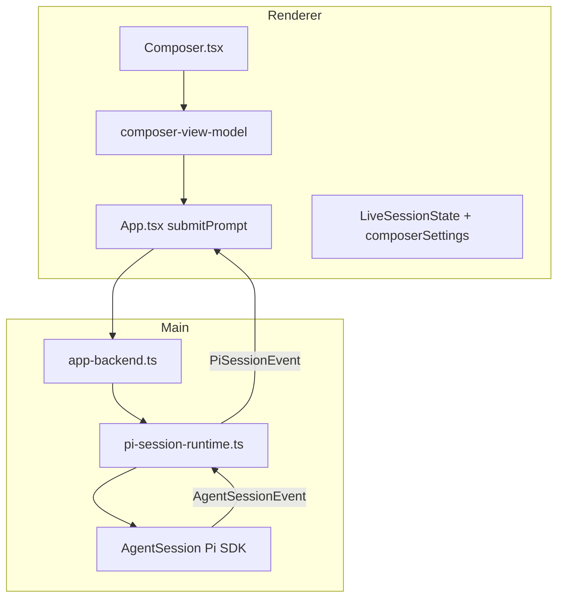
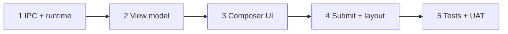

# M06: Composer Implementation Plan

## Goal

Deliver [M06 in the roadmap](docs/superpowers/specs/2026-05-12-pi-desktop-high-level-roadmap.md): turn the composer from a visual shell into the primary session input surface backed by Pi.

**Governing rule:** Follow Pi CLI semantics for model defaults, thinking defaults, prompt delivery, queued messages, and session behavior. Only diverge when the GUI needs a visible affordance for terminal/keyboard behavior; call out any intentional drift below.

## Reference mocks

Source of truth for running composer and queued-message UI:

- [.cursor/plans/mocks/m06-composer-running-empty-abort.png](.cursor/plans/mocks/m06-composer-running-empty-abort.png) — empty input while running, Abort primary
- [.cursor/plans/mocks/m06-composer-running-draft-send.png](.cursor/plans/mocks/m06-composer-running-draft-send.png) — draft while running, Send primary

## Verified current state

**Already working (M02–M05):**

- Composer UI, abort when `running && abortable` ([src/renderer/components/composer.tsx](src/renderer/components/composer.tsx))
- `onSubmit` / `onAbort` from [src/renderer/App.tsx](src/renderer/App.tsx) through [ChatStartState](src/renderer/components/chat-start-state.tsx) and [ChatShell](src/renderer/components/chat-shell.tsx)
- First + idle continued prompts via `piSession.start` / `piSession.submit`
- Hardcoded `ComposerContext` (`modelLabel: "5.5 High"`, stub menus) in [src/renderer/chat/chat-view-model.ts](src/renderer/chat/chat-view-model.ts)

**Confirmed gaps (no `delivery` / `session_settings` / `queue_update` in `src/` yet):**

| Gap                                                  | Location                                                                                                         |
| ---------------------------------------------------- | ---------------------------------------------------------------------------------------------------------------- |
| Project/model/mode menus are stubs                   | `composer.tsx` `ComposerControl`                                                                                 |
| Model/thinking not from Pi                           | `chat-view-model.ts`, runtime                                                                                    |
| Send disabled while running                          | `composer.tsx` L89; [pi-session-runtime.ts](src/main/pi-session/pi-session-runtime.ts) `assertNotBusy` on submit |
| Narrow `PiSdkSession` facade (`prompt(string)` only) | `pi-session-runtime.ts`                                                                                          |
| Auth errors not mapped to `disabledReason`           | `createComposerContext`                                                                                          |
| First live message can stay on centered start layout | `shouldUseChatStartLayout` in `chat-view-model.ts`                                                               |
| Settings/queue events not forwarded                  | [pi-session-event-normalizer.ts](src/main/pi-session/pi-session-event-normalizer.ts)                             |

**Pi SDK surface** (`@earendil-works/pi-coding-agent` `AgentSession` in pi-mono):

- `prompt(text, { streamingBehavior: "steer" \| "followUp" })` when streaming
- `setModel`, `setThinkingLevel`, `model`, `thinkingLevel`, `modelRegistry.getAvailable()`
- `queue_update` events; `getSteeringMessages()` / `getFollowUpMessages()` / `clearQueue()`
- CLI: Enter while streaming → steer queue; Option+Enter → follow-up queue

**Queue-management note:** Per-message delete/edit/delivery-switch is not a public SDK API today. Slice 1 must implement a main-process mutation path (e.g. read queues → rebuild via `clearQueue` + re-`prompt` with correct `streamingBehavior`, or thin wrappers aligned with interactive-mode queue handling). GUI affordances in slice 3 depend on this.

## Out of scope

- Attachments, voice, suggestion chips (stay disabled unless trivial fill-composer)
- M07 coding panels (tool timeline, file preview, diffs)
- M08 full settings/auth flows (M06 only surfaces actionable auth/model errors at composer)
- Git `branchLabel` (optional stretch)
- `@ai-sdk/react` `useChat` (per ADR / roadmap)

## Architecture

**Boundary:** Widen runtime adapter + typed IPC only. Keep `ModelRegistry` and provider secrets in main. Renderer gets labels, option lists, queue summaries, and safe error strings.

## Implementation slices

### Slice 1 — IPC, contracts, runtime adapter

**Shared** — [src/shared/pi-session.ts](src/shared/pi-session.ts), [src/shared/app-transport.ts](src/shared/app-transport.ts), [src/shared/preload-api.ts](src/shared/preload-api.ts), preload/IPC handlers:

- Extend `PiSessionSubmitInput` with optional `delivery: "prompt" | "steer" | "followUp"` (default `"prompt"`).
- Extend `PiSessionStartInput` with optional `modelProvider`, `modelId`, `thinkingLevel` for pre-session composer choices.
- New IPC (names can be refined, keep transport-neutral):
  - `getSettings({ sessionId })` → model/thinking snapshot + `availableModels[]` + `availableThinkingLevels[]`
  - `getDefaultSettings()` → same shape from Pi defaults/registry (no live session)
  - `setModel`, `setThinkingLevel` (live session)
  - `setDefaultModel`, `setDefaultThinkingLevel` (pre-session; updates Pi defaults for future sessions)
  - Queue ops: `updateQueuedMessage`, `removeQueuedMessage` (or equivalent) for delivery switch / delete / edit restore
- New `PiSessionEvent` variants:
  - `session_settings` — model + thinking snapshot (on start, change, after set)
  - `queue_update` — pending steer/follow-up summaries for composer rows + status copy

**Runtime** — [src/main/pi-session/pi-session-runtime.ts](src/main/pi-session/pi-session-runtime.ts):

- Store full `AgentSession` on `RuntimeEntry` (replace narrow `PiSdkSession` facade).
- `submit` when busy: `session.prompt(prompt, { streamingBehavior: delivery ?? "steer" })` instead of `assertNotBusy`.
- `submit` when idle: keep existing `runPrompt` path.
- Implement get/set settings via `setModel`, `setThinkingLevel`, registry `getAvailable()` / thinking-level helpers.
- Emit initial `session_settings` on session start.
- Implement queue mutation + forward `queue_update` from SDK stream.

**Normalizer** — [src/main/pi-session/pi-session-event-normalizer.ts](src/main/pi-session/pi-session-event-normalizer.ts):

- Forward `thinking_level_changed` → `session_settings`
- Forward `queue_update` and model-select extension events as needed

**Fakes/tests:** [src/main/pi-session/smoke-pi-session.ts](src/main/pi-session/smoke-pi-session.ts), [tests/main/pi-session-runtime.test.ts](tests/main/pi-session-runtime.test.ts)

**Pre-session preferences:** Project/global start composers show Pi defaults until user changes model/thinking. Selection updates Pi defaults (CLI parity) but does not add durable per-project store in M06. Project picker uses existing `project.select`; does not create a chat row before first Send.

### Slice 2 — Composer view model

**New:** [src/renderer/chat/composer-view-model.ts](src/renderer/chat/composer-view-model.ts)

- Build enriched `ComposerContext` from `ProjectStateView` + `LiveSessionState` + `ComposerSettingsState`.
- **Project menu:** first-message composers only (`global-start`, `project-start`, `standalone-start`, draft `empty-chat`). List `availability.status === "available"` projects; global start shows “Work in a project” when none selected. No project picker in active/resumed session composer.
- **Model menu:** `getSettings` (live) or `getDefaultSettings` (pre-session); label from Pi `name` or `id`.
- **Thinking menu:** repurpose existing **mode** control row (`off`, `low`, `medium`, `high`, … from `getAvailableThinkingLevels()`); keep “Work locally” as non-interactive header/text.
- **Blocked reasons:** no project, `sessionState.errorMessage` (auth/model strings), runtime unavailable.

Replace hardcoded `createComposerContext` in [src/renderer/chat/chat-view-model.ts](src/renderer/chat/chat-view-model.ts).

### Slice 3 — Composer UI wiring

[src/renderer/components/composer.tsx](src/renderer/components/composer.tsx):

- Props: menu option lists + `onSelectProject`, `onSelectModel`, `onSelectThinkingLevel`.
- Real selectable menus (keyboard + click-outside close); preserve M02 a11y.
- **While running:** enable Send when text present; submit → steer; Option+Enter → followUp; Abort separate; model/thinking stay enabled (call `setModel`/`setThinkingLevel` before steer send if changed).
- **Queued rows** above composer (oldest first, cap 3 visible): one-line preview, inline delivery toggle (`Steer` ↔ `Follow-up`), delete, overflow Edit/Delete. Edit restores text into composer and removes from queue preserving delivery mode.
- Status copy: “1 steering queued”, “1 follow-up queued”, “2 queued” (avoid “interrupt”).
- Placeholder/helper reflects running delivery context and Option+Enter hint.

[src/renderer/App.tsx](src/renderer/App.tsx):

- `onSelectProject` → `project.select` (no draft chat from picker).
- `onSelectModel` / `onSelectThinkingLevel` → live IPC or default-setting IPC when no `sessionId`.
- `submitPrompt` → `delivery: running ? "steer" : "prompt"`; keyboard path → `followUp` when running.
- Map error substrings (`No API key`, `Authentication failed`, `No model selected`) to composer blocked state.

### Slice 4 — Submit routing and layout

**Layout** — [shouldUseChatStartLayout](src/renderer/chat/chat-view-model.ts):

- Once `hasLiveSession(session)`, always use bottom session layout (`chat-shell--session`), including first prompt from draft `empty-chat`.
- Centered start layout only when idle, no messages, not resumable (existing rules).

Update [tests/renderer/chat-shell.test.ts](tests/renderer/chat-shell.test.ts) (today expects `chat-shell--start` for draft-first-message).

### Slice 5 — Verification

**Unit tests:**

- [tests/renderer/composer-state.test.ts](tests/renderer/composer-state.test.ts) — blocked reasons; send enabled while running with text
- [tests/renderer/composer.test.ts](tests/renderer/composer.test.ts) — menus, Option+Enter, queue row controls
- New `composer-view-model` tests — project list, auth blocked labels
- [tests/main/pi-session-runtime.test.ts](tests/main/pi-session-runtime.test.ts) — busy submit → steer/followUp; setModel/setThinkingLevel; queue mutation
- Session reducer tests for `session_settings` / `queue_update`

**Manual UAT (roadmap acceptance):**

1. Open project → real model/thinking labels
2. Change model/thinking before/during session; Pi defaults updated for future sessions
3. While running: change model/thinking, send steer → new settings at next steering point
4. Resumed idle chat uses bottom composer
5. Send while running → steer queued; abort separate
6. Option+Enter while running → follow-up queued
7. Queued rows visible with delivery toggle
8. Global start without project → disabled + reason; pick project from composer menu
9. `pnpm check` green

## Sequencing

Ship slice 1 with tests first so Electron and web preview share the same transport ([README.md](README.md) `dev:web`).

## Risks

| Risk                              | Mitigation                                                                  |
| --------------------------------- | --------------------------------------------------------------------------- |
| No public per-queue-item SDK API  | Implement queue rebuild/mutation in main runtime; keep logic centralized    |
| Model list needs auth             | Use `getAvailable()` only; empty menu + Pi error text                       |
| `setModel` throws without API key | Catch in main; typed IPC error → composer                                   |
| Project switch mid-session        | No project menu in session composer                                         |
| Pi CLI drift                      | Default to CLI; document GUI-only affordances (queue rows, delivery toggle) |
| M08 overlap                       | M06 = in-session quick controls; M08 = durable prefs + full auth UI         |

## Key files

| Area       | Files                                                                       |
| ---------- | --------------------------------------------------------------------------- |
| UI         | `composer.tsx`, `chat-shell.tsx`, `chat-start-state.tsx`                    |
| View model | `chat-view-model.ts`, **new** `composer-view-model.ts`                      |
| App        | `App.tsx`                                                                   |
| Runtime    | `pi-session-runtime.ts`, `pi-session-event-normalizer.ts`, `app-backend.ts` |
| Contracts  | `pi-session.ts`, `preload-api.ts`, `app-transport.ts`                       |

