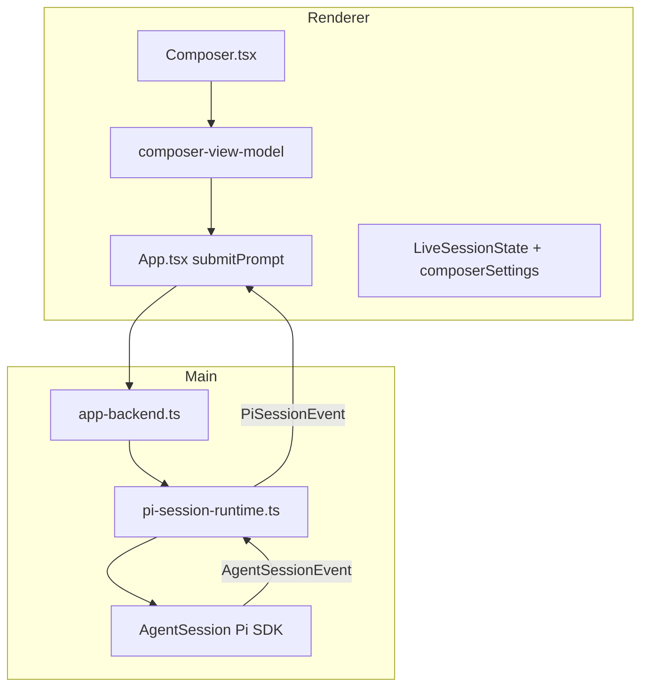
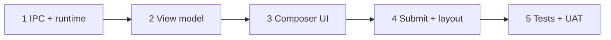

# M06: Composer Implementation Plan

## Goal

Deliver the roadmap milestone in [docs/superpowers/specs/2026-05-12-pi-desktop-high-level-roadmap.md](docs/superpowers/specs/2026-05-12-pi-desktop-high-level-roadmap.md) (M06 section): turn the composer from a review shell into the primary session input surface backed by Pi.

## Governing rule

Follow Pi CLI behavior for model defaults, thinking defaults, prompt delivery, queued messages, and session semantics. Do not drift unless the GUI requires a visible affordance for behavior that exists as a keyboard or terminal interaction in the CLI. Any intentional drift must be called out in this plan.

## Current state

## Reference mocks

Use these supplied mocks as the source of truth for running composer behavior and queued-message row placement:

- [Running composer with empty input, Abort primary](mocks/m06-composer-running-empty-abort.png)
- [Running composer with draft input, Send primary](mocks/m06-composer-running-draft-send.png)

**Already working (M02–M05):**

- Composer UI, disabled send when empty, abort button when `running && abortable` (`[src/renderer/components/composer.tsx](src/renderer/components/composer.tsx)`)
- `onSubmit` / `onAbort` wired from `[src/renderer/App.tsx](src/renderer/App.tsx)` through `[ChatStartState](src/renderer/components/chat-start-state.tsx)` and `[ChatShell](src/renderer/components/chat-shell.tsx)`
- First prompt + continued prompts on **idle** sessions via `piSession.start` / `piSession.submit`
- Static `ComposerContext` with hardcoded `modelLabel: "5.5 High"` and stub menus that only echo the label (`[src/renderer/chat/chat-view-model.ts](src/renderer/chat/chat-view-model.ts)`)

**Gaps blocking M06 acceptance:**

| Gap                                                                                                             | Where                                                                                                                                                        |
| --------------------------------------------------------------------------------------------------------------- | ------------------------------------------------------------------------------------------------------------------------------------------------------------ |
| Project/model/mode menus are non-functional stubs                                                               | `composer.tsx` `ComposerControl`                                                                                                                             |
| Model/thinking not read from Pi                                                                                 | `chat-view-model.ts`, runtime adapter                                                                                                                        |
| **Cannot send while agent is running** — send disabled when `running`; runtime `submit()` calls `assertNotBusy` | `composer.tsx`, `[pi-session-runtime.ts](src/main/pi-session/pi-session-runtime.ts)`                                                                         |
| No steer/follow-up IPC path                                                                                     | `PiSdkSession` only exposes `prompt(string)`                                                                                                                 |
| Auth/runtime errors not mapped to composer `disabledReason`                                                     | `createComposerContext` always `runtimeAvailable: true` for available projects                                                                               |
| Layout: first message from draft `empty-chat` can stay on centered start layout                                 | `shouldUseChatStartLayout` in `[chat-view-model.ts](src/renderer/chat/chat-view-model.ts)` (called out in M05 roadmap)                                       |
| Session settings events dropped                                                                                 | `[pi-session-event-normalizer.ts](src/main/pi-session/pi-session-event-normalizer.ts)` ignores `thinking_level_changed`, `queue_update`, model-select events |

**Pi SDK capabilities to use** (`@earendil-works/pi-coding-agent` `AgentSession`):

- `prompt(text, { streamingBehavior: "steer" \| "followUp" })` when `isStreaming` ([agent-session.ts](file:///Volumes/EVO/repos/pi-mono/packages/coding-agent/src/core/agent-session.ts))
- `setModel(model)`, `setThinkingLevel(level)`, `model`, `thinkingLevel`, `scopedModels`, `modelRegistry.getAvailable()`
- Interactive CLI default: Enter while streaming queues **steer** delivery. Option+Enter while streaming queues **followUp** delivery. Neither stops current work by itself; explicit abort/interrupt remains separate.

## Out of scope (explicit)

- Attachments, voice, suggestion chips (remain disabled unless trivial fill-composer only)
- M07 coding panels (tool timeline, file preview, diffs)
- M08 full settings/auth flows (provider setup UI); M06 only surfaces **actionable** auth/model errors at the composer
- Git `branchLabel` (optional stretch; not required for acceptance)
- `@ai-sdk/react` `useChat` (per ADR / roadmap)

## Architecture

**Boundary rule:** widen the runtime adapter and typed IPC; keep provider secrets and `ModelRegistry` in main. Renderer receives display labels, option lists, and safe error strings only.

## Implementation slices

### 1. Extend Pi session IPC and runtime adapter

**Shared contracts** — `[src/shared/pi-session.ts](src/shared/pi-session.ts)`, `[src/shared/app-transport.ts](src/shared/app-transport.ts)`, preload/IPC handlers:

- Extend `PiSessionSubmitInput` with optional `delivery: "prompt" | "steer" | "followUp"` (default `"prompt"`).
- Add operations (names can be refined, keep transport-neutral):
  - `piSession.getSettings` — `{ sessionId }` → `{ modelLabel, modelProvider, modelId, thinkingLevel, availableModels[], availableThinkingLevels[] }`
  - `piSession.getDefaultSettings` — no session → same safe settings snapshot from Pi defaults/model registry for project start and global start composers
  - `piSession.setModel` — `{ sessionId, provider, modelId }`, mirrors Pi CLI `AgentSession.setModel()` behavior
  - `piSession.setThinkingLevel` — `{ sessionId, level }`, mirrors Pi CLI `AgentSession.setThinkingLevel()` behavior
  - `piSession.setDefaultModel` — `{ provider, modelId }`, used before a live session exists and updates Pi defaults
  - `piSession.setDefaultThinkingLevel` — `{ level }`, used before a live session exists and updates Pi defaults
- Add renderer events (extend `PiSessionEvent` discriminated union):
  - `session_settings` — model + thinking snapshot (emit on start, on change, after setModel/setThinkingLevel)
  - `queue_update` — pending steering/follow-up message summaries for composer queue status and queued-message delivery controls

**Runtime** — `[src/main/pi-session/pi-session-runtime.ts](src/main/pi-session/pi-session-runtime.ts)`:

- Store the real `AgentSession` on `RuntimeEntry` (today `PiSdkSession` is a narrow facade).
- `submit` when busy: call `session.prompt(prompt, { streamingBehavior: delivery ?? "steer" })` instead of `assertNotBusy`. This queues the message for Pi's next steering point and does not abort current work.
- Add a queued-message mutation path for changing queued delivery between `steer` and `followUp` while messages remain queued. Mirror Pi CLI queue behavior, but expose a GUI affordance rather than requiring hidden keyboard-only knowledge.
- `submit` when idle: keep existing `runPrompt` path.
- Implement get/set settings by delegating to `AgentSession.setModel`, `setThinkingLevel`, and registry `getAvailable()` / `getAvailableThinkingLevels()`.
- On session start, emit initial `session_settings` from `session.model` / `session.thinkingLevel`.
- Update `[pi-session-event-normalizer.ts](src/main/pi-session/pi-session-event-normalizer.ts)` to forward `thinking_level_changed` → `session_settings` (and model-select extension events if emitted on the session stream).

**Pre-session preferences:** For M06, a project start composer shows Pi's default model/thinking unless the user changes them before Send. Composer model and thinking selection must mirror Pi CLI behavior: update Pi defaults for future new sessions, but do not persist durable project-specific defaults. Pass the chosen model/thinking into `piSession.start` via new optional fields on `PiSessionStartInput` (`modelProvider`, `modelId`, `thinkingLevel`). Selecting a project from the composer uses existing `project.select` and shows the project start composer; it does not create a chat row before first Send.

Update smoke/fake sessions in `[smoke-pi-session.ts](src/main/pi-session/smoke-pi-session.ts)` and `[tests/main/pi-session-runtime.test.ts](tests/main/pi-session-runtime.test.ts)`.

### 2. Composer view model and context

**New module** (suggested): `src/renderer/chat/composer-view-model.ts`

- Build enriched `ComposerContext` from `ProjectStateView` + `LiveSessionState` + `ComposerSettingsState` (model/thinking labels, menu options, blocked reason).
- **Project menu:** first-message composer only. List available projects (`projectState.projects` filtered to `availability.status === "available"`) plus current selection; global start shows “Work in a project” when none selected. Selecting a project only changes `selectedProjectId` and leaves `selectedChatId = null`. Do not show project selection in an active or resumed project session composer.
- **Model menu:** options from `getSettings` for live sessions or `getDefaultSettings` before a live session; label from Pi model `name` or `id`.
- **Thinking menu:** use the existing **mode** control row slot for thinking levels (`off`, `low`, `medium`, `high`, … per `getAvailableThinkingLevels()`); keep a static “Work locally” affordance as non-interactive text or submenu header so M02 “local-only” semantics stay visible.
- **Runtime blocked reasons:** derive from selection + session:
  - No project/chat → existing copy
  - `sessionState.errorMessage` containing auth/model errors after failed start/submit
  - Optional lightweight `piSession.probeAuth` only if needed; prefer reusing Pi error strings from failed `prompt` preflight

Replace hardcoded fields in `[chat-view-model.ts](src/renderer/chat/chat-view-model.ts)` `createComposerContext`.

### 3. Wire Composer UI interactions

`**[composer.tsx](src/renderer/components/composer.tsx)`:**

- Accept menu option lists + handlers: `onSelectProject`, `onSelectModel`, `onSelectThinkingLevel`.
- Replace stub `composer__local-menu` with selectable items (keyboard: arrow/enter; click outside closes).
- **While running:** enable send (not disabled) when text present; submit routes to steer delivery; keep abort behavior separate. Add Option+Enter keyboard handling for follow-up delivery. Keep model/thinking controls enabled. Do not show project selection in the session composer. If the user changes model/thinking before sending a steering message, call `setModel`/`setThinkingLevel` first so Pi uses the newly selected settings at the next steering point.
- Show queued messages as compact rows above the composer, matching the supplied mocks. Each queued row shows a one-line prompt preview, an inline delivery switch action (`Steer` for a follow-up row, `Follow-up` for a steering row), delete, and overflow actions.
- Queue row overflow actions for M06: Edit and Delete only. Edit restores the queued message into the composer and removes it from the queue while preserving its delivery mode in composer state. Delete removes that one queued message without confirmation.
- Show queued rows oldest first. Keep rows compact; cap visible rows at 3 if needed and defer richer queue management.
- Queue status copy uses direct labels such as “1 steering queued”, “1 follow-up queued”, or “2 queued”. Avoid “interrupt”.
- Abort remains separate from queue management. Desktop reflects Pi queue state if abort clears queued messages; otherwise queued messages remain.
- The composer placeholder reflects the current running delivery context, e.g. follow-up changes, and helper copy exposes Option+Enter while running.
- Preserve M02 a11y (`aria-haspopup`, `aria-expanded`).

`**[App.tsx](src/renderer/App.tsx)`:**

- `onSelectProject` → `window.piDesktop.project.select({ projectId })` (existing IPC); do not create a draft chat from the composer project picker.
- `onSelectModel` / `onSelectThinkingLevel` → new IPC when a live `sessionId` exists, including while running. If no `sessionId`, call default-setting IPC so pre-session selection mirrors Pi CLI behavior and updates Pi defaults for future new sessions.
- `submitPrompt` → pass `delivery: session running ? "steer" : "prompt"`; this matches Pi CLI Enter semantics while running.
- `submitFollowUpPrompt` or equivalent keyboard path → pass `delivery: session running ? "followUp" : "prompt"`; this matches Pi CLI Option+Enter semantics.
- Map known error substrings (`No API key`, `Authentication failed`, `No model selected`) into composer blocked state after failure.

### 4. Layout coherence (session composer for active chats)

Adjust `[shouldUseChatStartLayout](src/renderer/chat/chat-view-model.ts)`:

- Once `hasLiveSession(session)` is true, always use bottom session layout (`chat-shell--session` + `chat-shell__bottom-composer`), including first prompt from a draft `empty-chat`.
- Keep centered start layout only when idle, no messages, and not resumable per existing rules.

Update `[tests/renderer/chat-shell.test.ts](tests/renderer/chat-shell.test.ts)` for the draft-first-message case (today expects `chat-shell--start`).

### 5. Verification

**Unit tests:**

- `[tests/renderer/composer-state.test.ts](tests/renderer/composer-state.test.ts)` — blocked reasons, send enabled while running with text
- `[tests/renderer/composer.test.ts](tests/renderer/composer.test.ts)` — menu rendering/selection, Option+Enter follow-up delivery, queued-message delivery controls
- New `composer-view-model` tests — project list, auth blocked labels
- `[tests/main/pi-session-runtime.test.ts](tests/main/pi-session-runtime.test.ts)` — submit while busy uses steer, Option+Enter path uses followUp, queued delivery can be changed while pending; setModel/setThinkingLevel
- Session reducer tests for `session_settings` event

**Manual UAT (from roadmap acceptance):**

1. Open project → composer shows real model/thinking labels.
2. Change model/thinking before and during a session; next turn reflects change, and both selections follow Pi CLI default behavior for future new sessions.
3. While the agent is running, change model/thinking, type a steering message, then Send; Pi uses the newly selected settings at the next steering point.
4. Continue a resumed chat while idle via bottom composer.
5. Send while agent is running → message is queued for steering; abort remains a separate explicit action.
6. Option+Enter while agent is running → message is queued as follow-up.
7. Queued steering and follow-up messages render as compact rows above the composer and expose an inline visual control to switch delivery while still queued.
8. Global start without project → send disabled with clear reason; pick project from composer menu without sidebar-only navigation.
9. `pnpm check` green.

## Sequencing

Ship slice 1 behind feature-neutral tests first so web preview (`[dev:web](README.md)`) and Electron share the same transport.

## Risks and mitigations

| Risk                                | Mitigation                                                                                          |
| ----------------------------------- | --------------------------------------------------------------------------------------------------- |
| Model list requires auth configured | Show only models from `getAvailable()`; empty menu + disabled reason from Pi error text             |
| `setModel` throws without API key   | Catch in main, return typed IPC error; surface in composer                                          |
| Switching project from session composer | Do not offer project selection in active/resumed project session composers; project selection is first-message only. |
| Running model/thinking change ambiguity | Keep controls enabled; changing them before a steering Send updates the settings Pi uses at the next steering point. |
| Pi CLI drift | Follow Pi CLI behavior by default. Name any intentional drift in this plan, and only drift when GUI affordances require it. |
| Pi CLI drift for defaults | Use Pi settings/model registry as source of truth. Pre-session composer selection must update Pi defaults, matching CLI `setModel` and `setThinkingLevel` behavior. |
| M08 overlap (model in settings)     | M06 = in-session quick controls; M08 = durable prefs, provider auth, theme                          |

## Key files

| Area              | Files                                                                                                                                                                                                     |
| ----------------- | --------------------------------------------------------------------------------------------------------------------------------------------------------------------------------------------------------- |
| UI                | `[composer.tsx](src/renderer/components/composer.tsx)`, `[chat-shell.tsx](src/renderer/components/chat-shell.tsx)`, `[chat-start-state.tsx](src/renderer/components/chat-start-state.tsx)`                |
| View model        | `[chat-view-model.ts](src/renderer/chat/chat-view-model.ts)`, new `composer-view-model.ts`                                                                                                                |
| App orchestration | `[App.tsx](src/renderer/App.tsx)`                                                                                                                                                                         |
| Runtime           | `[pi-session-runtime.ts](src/main/pi-session/pi-session-runtime.ts)`, `[pi-session-event-normalizer.ts](src/main/pi-session/pi-session-event-normalizer.ts)`, `[app-backend.ts](src/main/app-backend.ts)` |
| Contracts         | `[pi-session.ts](src/shared/pi-session.ts)`, `[preload-api.ts](src/shared/preload-api.ts)`                                                                                                                |

