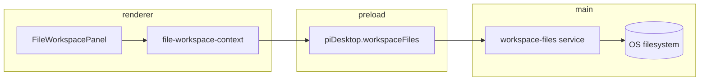

# M07B: Right Panel File Explorer + Viewer/Editor Spec
## Status
Implemented
## Goal
Turn the right-panel **File** surface from mock content into a VS Code–like project file workspace: a project-scoped explorer tree, readable file viewers, and a lightweight text editor with explicit save—while chat, composer, and other workspace tabs (Terminal, Browser, Changes) keep working unchanged.
## Background
- **M07A.2** shipped the workspace tab strip and mock panels (`terminal`, `browser`, `markdown`, `diffs`) in `src/renderer/right-panel/`.
  
- The product mock shows a **split File panel**: explorer (left) + viewer (right), project header, folder/file tree, breadcrumbs, and a **Preview | Markdown** toggle for `.md` files.
  
- The renderer already renders Markdown for chat via `marked` **+** `dompurify` in `src/renderer/components/message-content.tsx`.
  
- There is **no filesystem IPC** today; preload exposes `app`, `project`, `chat`, and `piSession` only (`src/preload/index.ts`).
  
- **Project selection** is the filesystem authority: `ProjectStateView.selectedProject.path`. This is independent of chat/session `cwd` (used only for Pi runtime/composer).
  
## Requirements
- Project-scoped file explorer rooted at `selectedProject.path`, with expand/collapse, loading states, empty states, and visible project name / path context.
  
- **File panel** (replacing `MarkdownPanelMock`) uses a persistent **explorer | viewer** split matching the approved mock.
  
- **Lazy directory listing** via main-process IPC (children loaded when folders expand).
  
- **Editor tabs** inside the file panel for multiple open files (filename labels, active tab, dirty indicator).
  
- Read-only viewing for safe text, Markdown (preview + source), and code-like extensions; clear states for unsupported, binary, missing, and too-large files.
  
- Lightweight **text editor** (`<textarea>`) for editable text files; explicit save; dirty tracking; visible save success/error feedback.
  
- Main/preload **narrow typed IPC** for `listDirectory`, `readFile`, `writeFile` with **path confinement** to the selected project root (no arbitrary filesystem access from renderer).
  
- Renderer state for explorer expansion/selection, open editor tabs, per-file load status, dirty buffers, and operation errors.
  
- Unsaved-change prompts when closing editor tabs, switching files, or changing selected project—no silent discard.
  
- Web preview (`dev-preview-api.ts`) gains mock filesystem responses for visual review without Electron.
  
- Focused unit tests for path guards, file state reducers, and key UI flows; full `pnpm check` passes.
  
## Non-goals
- Git/PR panel (M07C), Terminal (M07D), Browser (M07E).
  
- Chat/session coupling, standalone-chat `cwd`, or agent tool-write integration.
  
- Monaco/CodeMirror, LSP, syntax highlighting, multi-cursor, or format-on-save.
  
- Create/rename/delete/move files, drag-and-drop tree reorder, or “New file” / “Collapse all” behavior (toolbar icons may render disabled or be omitted until a later milestone).
  
- Binary/media preview, PDF/DOCX pipelines (deps exist elsewhere; out of scope).
  
- Watching filesystem changes (reload on external edit is best-effort manual only).
  
- Dotfile/`node_modules` visibility toggles in UI (main may still skip `node_modules` for performance).
  
## Proposed approach
### Product model (aligned with mock)
| Layer | Behavior |
| --- | --- |
| **Workspace tab strip** (M07A.2) | One activatable **Files** workspace tab (`kind: "files"`). Terminal / Browser / Changes stay mock. |
| **File panel body** | Split view: **explorer** (left) + **viewer** (right). |
| **Editor tabs** | Horizontal tabs in the viewer chrome (under/over breadcrumbs) for open files; not one workspace strip tab per file. |
| **Filesystem root** | `selectedProject.path` only. If no project or project unavailable, show empty/error state—never chat `cwd`. |
| **Markdown** | Reuse `marked` + `dompurify` via a shared renderer module; **Preview** vs **Markdown** (source) toggle. |
| **Plain/code files** | Monospace source view; same editor surface for edit mode. |
### Package choices
| Concern | Decision |
| --- | --- |
| Markdown | **No new package.** Extract shared `renderMarkdownHtml()` from `message-content.tsx`. |
| Explorer tree | **Custom lazy tree** for M07B (minimal deps, full control of pi-desktop styling). Revisit `@headless-tree/react` only if keyboard/typeahead requirements outgrow a thin implementation. |
| Editor | Native `<textarea>` with project styles. |
### Panel kind migration
- Rename right-panel kind `markdown` → `files` (update types, add menu, mocks, tests, and default tabs).
  
- Add menu: single **Files** entry (remove mock `markdown-file` / `markdown-doc` duplicates).
  
- `addOrActivateRightPanelTab` treats `files` as a **singleton** workspace tab (like `terminal` / `browser`).
  
### Filesystem IPC (main)
New feature folder: `src/main/workspace-files/`

- `resolvePathWithinProjectRoot(projectRoot, relativePath)` — `path.resolve`, `fs.realpath` on root and target, reject paths that escape root (including symlink tricks).
  
- `listDirectory({ projectRoot, relativePath })` — returns sorted entries `{ name, relativePath, kind: "file" \| "directory" }`; skips `node_modules` at top level (and optionally other heavy dirs); optional hide of dot-directories except `.git` at root if needed later.
  
- `readFile({ projectRoot, relativePath })` — returns discriminated union: `text` (content, encoding, size), `binary`, `too_large`, `not_found`, `unsupported`.
  
- `writeFile({ projectRoot, relativePath, content })` — UTF-8 text only; rejects binary/oversized/out-of-root.
  

Constants (tune in implementation, document in code):

- `MAX_READ_BYTES` ≈ 1–2 MiB for text load.
  
- `MAX_WRITE_BYTES` same order.
  
- Text extensions allowlist + “no null bytes” heuristic for binary detection.
  

Wire through existing patterns:

- Zod schemas in `src/shared/workspace-files.ts`.
  
- `IpcChannels` + `AppRpcOperation` entries + `app-backend` handlers.
  
- Preload `piDesktop.workspaceFiles.*` mirroring project IPC (`safeInvokeParse`).
  
### Renderer
New feature folder: `src/renderer/file-workspace/`

| Module | Responsibility |
|--------|----------------|
| `file-workspace-types.ts` | Editor tab, load status, view mode (`preview` \| `source`), errors |
| `file-workspace-state.ts` | Pure reducers: open/close/select tab, set dirty, apply read/write results, explorer expand/select |
| `file-workspace-context.tsx` | Holds state; subscribes to `selectedProject` from props/context; calls IPC |
| `file-explorer.tsx` | Custom lazy tree UI |
| `file-viewer.tsx` | Chrome: breadcrumbs, Preview/Markdown toggle, editor tabs |
| `file-editor.tsx` | Textarea + save affordance + status line |
| `file-empty-states.tsx` | No project, missing project, IPC errors |

Replace `MarkdownPanelMock` branch in `right-panel-body.tsx` with `<FileWorkspacePanel project={...} />`.

Pass `selectedProject` from `AppShell` / `RightPanelProvider` (extend provider props or consume project state via a narrow hook from `App`).
### Styling
- Extend `src/renderer/styles.css` with BEM-style classes under `.file-workspace`, `.file-explorer`, `.file-viewer` aligned to the mock (dark theme, selection blue, split panes).
  
- Explorer/viewer split uses CSS grid or flex; respect narrow workspace layout (stack explorer above viewer when needed).
  
### Web preview
- Add `workspaceFiles` methods to `dev-preview-api.ts` with a small in-memory tree under `/tmp/pi-desktop-preview/pi-desktop` (include `AGENTS.md`, `README.md`, a nested `docs/` folder).
  
- `unavailable-api.ts` returns structured errors for missing API.
  
## User experience / workflow
1. User selects a project in the left sidebar.
  
2. User opens or focuses the **Files** workspace tab.
  
3. Explorer shows the project tree; user expands folders (spinner while loading).
  
4. User clicks a file → viewer opens an editor tab, loads content, selects row in tree.
  
5. For `.md`, default to **Preview**; toggle to **Markdown** shows source; editing switches to source or unified source mode (spec: **editing always uses source**; preview read-only).
  
6. User edits text → tab shows dirty dot; **Save** (button + ⌘S) writes via IPC; success clears dirty; failure shows inline error.
  
7. User closes dirty tab or switches project → confirmation dialog (Save / Don’t Save / Cancel).
  
8. User keeps chatting in the center column throughout.
  
## Technical design

### Data shapes (sketch)
```ts
// Editor tab id stable per relativePath
type FileEditorTab = {
  id: string;
  relativePath: string;
  title: string; // basename
  dirty: boolean;
  savedContent: string | null;
  buffer: string;
  status: "idle" | "loading" | "loaded" | "error";
  error?: string;
  viewMode: "preview" | "source";
  readOnly: boolean;
};
```
### Security
- All relative paths normalized (no `..` segments after resolve).
  
- Operations require `projectRoot` from main’s view of the selected project record (renderer passes `projectId`; main resolves path from store—not trusting renderer-supplied absolute paths for writes).
  
- Prefer validating on every call even if `projectId` is stale.
  
## Data and API changes
- New `src/shared/workspace-files.ts` (Zod + types).
  
- Extend `IpcChannels`, `AppRpcRequestSchema`, `PiDesktopApi`, preload, `app-backend`, `dev-preview-api`, `unavailable-api`.
  
- `RightPanelKind`: `markdown` → `files`; `RightPanelTab` may add optional `relativePath` only for documentation—editor tabs live in file-workspace state, not workspace strip.
  
## Error handling and edge cases
| Case | UX  |
| --- | --- |
| No project selected | Explorer: “Select a project to browse files.” |
| Project `missing` / `unavailable` | Show availability reason; disable IPC |
| IPC failure | Inline error with retry |
| File deleted on disk after open | Save fails with clear message; offer close tab |
| Race: project switch during load | Abort in-flight; reset state for new project |
| Large file | `too_large` state with path + size guidance |
| Binary | Message + no editor |
| Unsupported extension | Read-only message listing supported types |
## Test strategy
| Area | Tests |
| --- | --- |
| Main | `tests/main/workspace-files-path.test.ts` — escape attempts, symlink boundary (temp dirs), `node_modules` skip |
| Main | `tests/main/workspace-files-io.test.ts` — read/write roundtrip, size limits |
| Renderer | `tests/renderer/file-workspace-state.test.ts` — tabs, dirty, close prompts logic |
| Renderer | `tests/renderer/file-workspace-panel.test.tsx` — static markup for explorer + preview toggle |
| Update | `right-panel-state.test.ts`, `right-panel-workspace.test.tsx`, `chat-shell.test.ts` for `files` kind |
| Preview | Manual `pnpm dev:web` — open Files, expand tree, preview AGENTS.md |
## Implementation plan
### Phase 1: Shared contracts + main filesystem service
- [ ] 
  
  Add `src/shared/workspace-files.ts` schemas and result types.
  
- [ ] 
  
  Implement `src/main/workspace-files/` (path guard, list/read/write).
  
- [ ] 
  
  Add `tests/main/workspace-files-*.test.ts`.
  
- [ ] 
  
  Verification: `pnpm test tests/main/workspace-files`
  
### Phase 2: IPC + preload + preview mock
- [ ] 
  
  Register `workspaceFiles.*` in `app-transport`, `app-backend`, `ipc.ts`, `preload`, `global.d.ts`.
  
- [ ] 
  
  Extend `dev-preview-api.ts` and `unavailable-api.ts`.
  
- [ ] 
  
  Verification: `pnpm typecheck`
  
### Phase 3: Renderer state + shared markdown
- [ ] 
  
  Extract `src/renderer/markdown/render-markdown-html.ts`; update `message-content.tsx` to import it.
  
- [ ] 
  
  Add `file-workspace-state.ts` + tests.
  
- [ ] 
  
  Verification: `pnpm test tests/renderer/file-workspace-state`
  
### Phase 4: File panel UI
- [ ] 
  
  Migrate `markdown` → `files` kind; update add menu, defaults, mocks, tests.
  
- [ ] 
  
  Build `file-explorer`, `file-viewer`, `file-editor`, `file-workspace-context`, `FileWorkspacePanel`.
  
- [ ] 
  
  Wire `right-panel-body.tsx` and project props from `App` / `RightPanelProvider`.
  
- [ ] 
  
  Add CSS for split layout and mock parity.
  
- [ ] 
  
  Verification: `pnpm test tests/renderer/file-workspace-panel tests/renderer/right-panel`
  
### Phase 5: Save, dirty prompts, polish
- [ ] 
  
  Implement save (button + keyboard), dirty indicators, unsaved close/switch-project dialogs.
  
- [ ] 
  
  Handle edge cases (binary, too large, missing file).
  
- [ ] 
  
  Verification: manual Electron smoke + `pnpm dev:web` preview
  
### Phase 6: Full verification
- [ ] 
  
  Run `pnpm check`.
  
- [ ] 
  
  Update roadmap note if implementation completes M07B acceptance.
  
## Acceptance criteria
- [ ] 
  
  With a project selected, user opens **Files** workspace tab and sees a real explorer rooted at that project.
  
- [ ] 
  
  User can expand folders, select files, and open multiple files as **editor tabs** inside the file panel.
  
- [ ] 
  
  Markdown files support **Preview** and **Markdown** (source) modes using sanitized HTML from existing packages.
  
- [ ] 
  
  Text/code files display readable monospace content; binary/unsupported/oversized/missing files show dedicated states.
  
- [ ] 
  
  User can edit a text file, see dirty state, save explicitly, and see persisted content after reload/reopen.
  
- [ ] 
  
  File IPC rejects paths outside the project root (covered by tests).
  
- [ ] 
  
  Unsaved changes prompt on close tab and project switch; no silent data loss.
  
- [ ] 
  
  Chat, composer, session streaming, and other workspace tabs still work.
  
- [ ] 
  
  `pnpm check` passes.
  
## Build handoff
- **Spec path:** `docs/specs/2026-05-22-m07b-right-panel-file-workspace.md`
  
- **Approved scope:** M07B file workspace only—`src/main/workspace-files/`, shared IPC, `src/renderer/file-workspace/`, markdown helper extraction, right-panel kind migration, styles, preview mock, tests listed above.
  
- **Non-goals:** M07C–E panels, file CRUD, Monaco, filesystem watcher, chat/session cwd as explorer root.
  
- **Ordered task list:** Phase 1 → 6 as above.
  
- **Verification commands:** `pnpm test tests/main/workspace-files`, `pnpm test tests/renderer/file-workspace`, `pnpm check`.
  
- **Required fixtures:** Temp dirs in main tests; preview tree in `dev-preview-api.ts` under preview `pi-desktop` project path.
  
- **Known risks:** Symlink escape on macOS; performance listing large directories; `node_modules` omission confusing users—document in UI later.
  
- **Blocking open questions:** None
  
## Open questions
- None

## Build completion report

- **Spec path:** `docs/specs/2026-05-22-m07b-right-panel-file-workspace.md`
- **Base SHA:** `5e804457ded9f0da4edb551b9bd0b4221c96d9a2`
- **Tasks completed:** Phases 1–6 (shared contracts, main filesystem service, IPC/preload/preview mock, renderer file workspace, save/dirty flows, tests)
- **Key files:** `src/main/workspace-files/`, `src/shared/workspace-files.ts`, `src/renderer/file-workspace/`, `src/renderer/markdown/render-markdown-html.ts`, right-panel `files` kind migration
- **Verification:** `pnpm typecheck`, `pnpm test` (457 passed), `pnpm lint` (pre-existing biome schema version info only)
- **Review:** Single-agent path; independent subagent review not used
- **Follow-ups:** Run `pnpm check` (includes smoke) before merge; manual `pnpm dev:web` / Electron UAT for explorer + save flows
