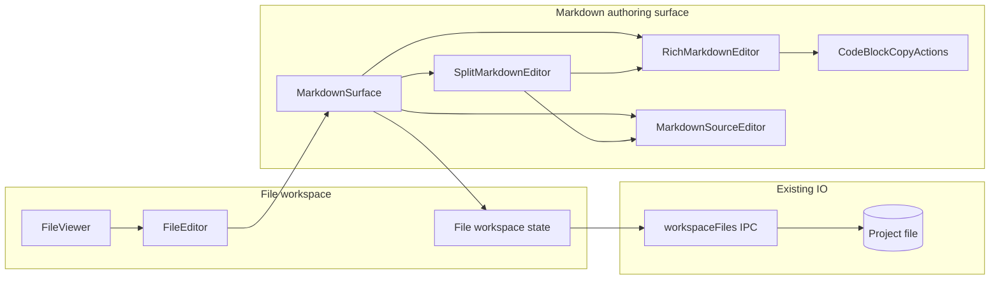

# World-Class Markdown Support Design

## Status

Approved for Build.

## Source of truth

- GitHub issue: [#14 Create world-class Markdown support](https://github.com/gannonh/pi-desktop/issues/14)
- Prior file workspace spec: [`docs/specs/2026-05-22-m07b-right-panel-file-workspace.md`](./2026-05-22-m07b-right-panel-file-workspace.md)
- Renderer design boundary: [`docs/adr/0003-shadcn-ui-boundary.md`](../adr/0003-shadcn-ui-boundary.md)
- Visual tokens: [`DESIGN.md`](../../DESIGN.md) and `src/renderer/styles.css`

## Goal

Make Markdown files a first-class authoring surface in Pi Desktop. Users can read, edit, and save Markdown through a polished preview, high-quality source editor, and split view while retaining the existing file workspace save, dirty-state, tab, and project-root safety model.

## Verified current state

- The file workspace already opens project-scoped files through typed `workspaceFiles` IPC with path confinement.
- Markdown tabs default to `preview` mode through `src/renderer/file-workspace/file-workspace-state.ts`.
- `src/renderer/file-workspace/file-editor.tsx` currently renders Markdown preview with sanitized HTML and edits source with a native `<textarea>`.
- Shared Markdown rendering lives in `src/renderer/markdown/render-markdown-html.ts` and uses `marked` plus `dompurify`.
- Save, dirty indicators, keyboard save, tab close prompts, and project switch prompts already belong to the file workspace.
- The renderer uses custom file workspace chrome with project tokens and BEM-style classes, as allowed by ADR 0003.

## Requirements

- Open Markdown files in a polished editable preview by default.
- Provide `Preview`, `Markdown`, and `Split` modes.
- Support full WYSIWYG preview editing for common authoring operations: headings, paragraphs, emphasis, links, images, ordered and unordered lists, task lists, blockquotes, fenced code blocks, inline code, thematic breaks, and tables.
- Provide a capable Markdown source editor with syntax highlighting, line context, selection, undo/redo, find, paste behavior, and keyboard-friendly editing.
- Keep code and preview modes visually cohesive with Pi Desktop tokens.
- Preserve readable Markdown source after preview edits.
- Persist edits through existing file workspace save behavior.
- Keep malformed or unsupported Markdown recoverable through source mode.
- Add copy actions for rendered code blocks.
- Keep link handling safe in the Electron renderer.

## Non-goals

- Replacing the file workspace IPC, project-root confinement, open-tab model, or save lifecycle.
- Collaborative editing, comments, change tracking, or multi-user cursors.
- Mermaid, math, diagrams, MDX JSX editing, custom component embeds, and frontmatter form editing.
- Filesystem watching or automatic reload on external file changes.
- Full app shell or workspace tab redesign.
- Rich editing for non-Markdown files.

## Recommended approach

Use `@mdxeditor/editor` for rich Markdown editing and CodeMirror 6 for source mode.

This gives Pi Desktop a production-oriented WYSIWYG Markdown surface with plugins for headings, lists, links, images, tables, code blocks, thematic breaks, quote blocks, task lists, toolbar actions, and source editing. It also keeps implementation focused on integrating the editor into the existing file workspace rather than building Markdown editing primitives from scratch.

Package versions and peer dependencies should be selected during Build after checking current package compatibility with React 19, Vite 8, TypeScript 6, and Electron 42.

### Alternatives considered

1. **MDXEditor plus CodeMirror 6**
   - Best fit for full WYSIWYG, tables, source mode, and React integration.
   - Main risks are dependency size, CSS containment, and source normalization.

2. **Milkdown**
   - Strong Markdown and ProseMirror foundation.
   - Requires more product integration work for toolbar, source mode, and Pi Desktop styling.

3. **Custom CodeMirror 6 live preview**
   - Maximum control over source fidelity and workbench integration.
   - Highest implementation cost for tables, block editing, toolbar behavior, and accessibility.

## Architecture



### Ownership boundaries

- `file-workspace` owns project selection, tabs, file load state, dirty state, save, close prompts, and mode selection.
- `markdown` owns rendering, rich editing, source editing, code block actions, Markdown editor adapters, and editor-specific CSS containment.
- `workspaceFiles` IPC remains the only persistence path for project files.
- Renderer styling uses Pi Desktop variables and file workspace classes. Editor library CSS must be scoped under the Markdown surface wrapper.

## UX design

### Modes

- `Preview`: editable rich Markdown document, selected by default for Markdown files.
- `Markdown`: source editor backed by CodeMirror 6.
- `Split`: source editor and rich preview side by side, sharing one tab buffer.

Mode switching must preserve unsaved edits. Scroll position and selection should be preserved on a best-effort basis per mode. The mode toggle remains in the file viewer header near the current `Preview | Markdown` control and adds `Split`.

### Preview editing

Preview mode should expose a compact toolbar for common document actions:

- block type: paragraph, heading levels, quote, code block
- inline marks: bold, italic, strikethrough, inline code
- lists: bullet, ordered, task list
- links and images
- table insert and row or column operations
- undo and redo when supported by the editor instance

The toolbar should use existing renderer control styling or shadcn primitives where generic controls are needed. Icons must come from `lucide-react`.

### Source editing

Source mode should replace the current `<textarea>` for Markdown files with a CodeMirror-backed editor. Required affordances:

- Markdown syntax highlighting
- visible line context
- native-feeling selection and paste
- find support
- undo and redo
- keyboard save through the existing file workspace handler
- project-theme colors, focus states, and typography

### Split editing

Split mode shows source and rich editor panes in the file viewer body. Source edits update the rich pane. Rich edits update source. Implement throttling or transaction batching if immediate updates cause input lag.

### Code blocks

Rendered code blocks should show language labels when available and provide a copy button. Copy failure must surface visibly in the code block or status area. Syntax highlighting can use CodeMirror language support in source mode and a lightweight rendered-code highlighter only if it fits package and performance constraints during Build.

### Links and images

- Links in preview open through a safe external-open handler or a guarded click handler. They must not silently navigate the Electron renderer.
- Relative image paths should resolve against the Markdown file's project-relative directory when feasible. If that is too large for the first implementation pass, show a clear unsupported image state and keep source mode reliable.
- Remote images may render through the browser when allowed by existing app policy. Build should verify current CSP and Electron constraints before committing behavior.

## Source fidelity rules

- Markdown source remains the saved representation.
- Preview edits may normalize whitespace, table alignment, and list indentation.
- The editor must preserve semantic content across mode switches and saves.
- Unsupported constructs should remain editable in source mode.
- Raw HTML support defaults off. A later ADR or spec can opt in with a sanitizer policy.
- If a document contains constructs the rich editor cannot safely parse, Pi Desktop should open source mode with a visible explanation and allow saving from source mode.

## Data flow

1. User opens a `.md` or `.markdown` file.
2. Existing `workspaceFiles.readFile` loads UTF-8 source into the active file tab buffer.
3. `FileViewer` passes the active tab to the Markdown surface when the path is Markdown.
4. Rich, source, and split modes edit the same tab buffer through `updateBuffer(tab.id, markdown)`.
5. Dirty state is computed by existing file workspace reducers.
6. Save writes the current buffer through existing `workspaceFiles.writeFile`.
7. Successful save updates `savedContent`, clears dirty state, and preserves the selected mode.

## Suggested file map

| Area | Likely files |
| --- | --- |
| Dependencies | `package.json`, lockfile |
| Markdown surface | `src/renderer/markdown/markdown-surface.tsx` |
| Rich editor adapter | `src/renderer/markdown/rich-markdown-editor.tsx` |
| Source editor adapter | `src/renderer/markdown/markdown-source-editor.tsx` |
| Code actions | `src/renderer/markdown/code-block-actions.tsx` |
| File workspace integration | `src/renderer/file-workspace/file-editor.tsx`, `src/renderer/file-workspace/file-viewer.tsx`, `src/renderer/file-workspace/file-workspace-state.ts`, `src/renderer/file-workspace/file-workspace-types.ts` |
| Styles | `src/renderer/styles.css` or a feature-owned stylesheet imported by the renderer if existing build rules allow it |
| Tests | `tests/renderer/markdown-*.test.tsx`, `tests/renderer/file-workspace-*.test.tsx` |
| Preview fixture | `src/renderer/dev-preview-api.ts` |

## Implementation phases

### Phase 1: Dependency and editor spike

- Confirm `@mdxeditor/editor` and required peer dependencies install cleanly with the current stack.
- Build a local Markdown editor harness or isolated component test with representative Markdown fixtures.
- Verify GFM tables, task lists, code blocks, links, and source serialization.
- Decide exact package versions and record any peer dependency constraints in the implementation notes or package comments if needed.

Acceptance:

- A representative Markdown fixture round-trips through the chosen editor with no content loss.
- Dependency CSS can be scoped or overridden under a Pi Desktop wrapper.

### Phase 2: Markdown surface abstraction

- Add a `MarkdownSurface` component that receives `value`, `mode`, `readOnly`, `relativePath`, `onChange`, and editor action callbacks.
- Add rich, source, and split subcomponents behind that wrapper.
- Keep non-Markdown files on the existing source editor path until separate source editor work is scoped.

Acceptance:

- Markdown files render through `MarkdownSurface`.
- Non-Markdown file behavior remains unchanged.

### Phase 3: File workspace mode integration

- Extend `FileViewMode` to include `split`.
- Update the file viewer mode toggle to `Preview`, `Markdown`, and `Split`.
- Preserve selected mode per open Markdown tab.
- Ensure dirty state changes only when editor content changes.

Acceptance:

- Mode switching preserves unsaved edits.
- Save and close prompts behave consistently across all Markdown modes.

### Phase 4: Rich authoring and toolbar polish

- Enable plugins for headings, lists, task lists, links, images, quotes, thematic breaks, tables, and code blocks.
- Add a compact toolbar aligned with Pi Desktop controls.
- Add visible unsupported-state handling for rich editor parse failures.
- Add safe link click handling.

Acceptance:

- Users can author realistic docs in preview mode without using source mode for common operations.
- Unsupported content remains recoverable through source mode.

### Phase 5: Code blocks, images, and visual finish

- Add code block copy actions.
- Add language labels for fenced code blocks when available.
- Implement relative image behavior or clear unsupported image messaging.
- Tune typography, spacing, tables, blockquotes, task lists, code, and focus states for dark and light tokens.

Acceptance:

- Markdown preview quality matches the issue's realistic-doc requirements.
- Code block copy success and failure are visible.

### Phase 6: Tests, fixtures, and verification

- Add fixtures for headings, tables, task lists, code blocks, images, links, blockquotes, malformed Markdown, and unsupported constructs.
- Add renderer tests for mode switching, edit callbacks, save integration, toolbar presence, read-only states, and source fallback.
- Add or update web preview mock content with representative Markdown.
- Run targeted tests and final project checks.

Acceptance:

- Focused renderer tests cover the Markdown authoring contract.
- `pnpm check` passes before Build closeout.

## Error handling and edge cases

| Case | Expected behavior |
| --- | --- |
| Rich editor parse failure | Open source mode, show explanation, keep buffer editable and saveable. |
| Unsupported Markdown construct | Preserve source, show source-mode escape hatch, avoid destructive serialization. |
| Save failure | Use existing file viewer save error path. |
| Read-only or blocked file state | Disable editing controls and show the existing blocked state. |
| Large file blocked by IPC | Keep existing too-large state. |
| Copy code block failure | Show inline copy error or status message. |
| Unsafe link | Block navigation and show a visible warning or no-op with accessible label. |
| Raw HTML | Treat as source-only unless a sanitizer policy is approved. |
| Editor dependency load error | Show recoverable source editor fallback if available, plus visible error. |

## Testing and verification

### Automated tests

- `tests/renderer/markdown-surface.test.tsx`
  - renders preview mode
  - emits Markdown changes from rich editor
  - renders source mode
  - renders split mode
  - disables editing when `readOnly` is true
- `tests/renderer/file-workspace-state.test.ts`
  - supports `split` mode
  - preserves dirty state across mode switches
- `tests/renderer/file-workspace-panel.test.tsx` or interaction tests
  - opens Markdown tab with preview default
  - switches modes
  - saves edited Markdown through existing callbacks
- `tests/renderer/message-content.test.ts`
  - keeps chat Markdown rendering sanitized if shared rendering changes

### Manual UAT

Use `pnpm dev:web` or desktop dev mode with a project containing a Markdown fixture.

1. Open `README.md` in Files.
2. Verify editable preview opens by default.
3. Edit a heading, paragraph, list, task item, table cell, link, blockquote, and code block.
4. Switch to `Markdown` and verify readable source.
5. Switch to `Split`, edit source, and verify preview updates.
6. Save, close the tab, reopen the file, and verify content persisted.
7. Test code block copy.
8. Test malformed Markdown and unsupported constructs.
9. Confirm dirty prompts still appear when closing or switching projects with unsaved edits.

### Commands

During Build, run the smallest deterministic checks after each phase. Final verification should include:

```bash
pnpm test tests/renderer/markdown-surface.test.tsx
pnpm test tests/renderer/file-workspace-state.test.ts tests/renderer/file-workspace-panel.test.tsx
pnpm check
```

Exact test filenames may change if Build chooses a different naming split.

## Risks and mitigations

| Risk | Mitigation |
| --- | --- |
| Source formatting normalization surprises users | Document source-fidelity rules, preserve semantic content, keep source mode available. |
| Dependency CSS leaks into app chrome | Scope editor styles under a Markdown wrapper and audit `styles-audit` coverage if needed. |
| Editor package conflicts with React 19 or Vite 8 | Run a Phase 1 dependency spike before replacing the current editor path. |
| Large Markdown files cause slow rich editing | Keep IPC size limits, allow source fallback, and defer virtualization unless measured. |
| Rich editor cannot safely handle some Markdown | Detect parse failures, open source mode, and avoid destructive writes. |
| Split mode update loops cause typing lag | Use a single source buffer and editor transaction guards. Add throttling only if measured. |

## Acceptance criteria

- [ ] Markdown files open in editable `Preview` mode by default.
- [ ] Users can switch between `Preview`, `Markdown`, and `Split` modes.
- [ ] Preview edits persist to Markdown source and reload correctly.
- [ ] Source edits update preview without losing unsaved changes.
- [ ] Headings, tables, task lists, links, images, code blocks, blockquotes, lists, inline code, and thematic breaks render and edit correctly.
- [ ] Code blocks provide copy actions with visible success or failure feedback.
- [ ] Save, dirty state, keyboard save, close prompts, and error handling match existing file workspace behavior.
- [ ] Styling uses Pi Desktop renderer tokens and does not introduce a separate visual system.
- [ ] Unsupported or malformed Markdown remains recoverable through source mode.
- [ ] Focused renderer tests cover parsing/rendering, mode switching, preview editing, and save behavior.
- [ ] `pnpm check` passes before implementation signoff.

## Explicitly deferred work

- Mermaid, math, and diagram rendering.
- MDX JSX component editing.
- Frontmatter-specific form controls.
- Collaborative review annotations.
- Rich Markdown editing outside the file workspace.
- Broad source editor upgrade for all text and code files.

## Implementation notes

### B1 dependency spike

- Installed `@mdxeditor/editor@4.0.1`. Its published peer dependencies accept the current React 19 and React DOM 19 stack.
- MDXEditor brings CodeMirror 6, Lexical, and Radix editor dependencies transitively. Build phases should keep product icons on `lucide-react` rather than using package-provided Radix icons in Pi Desktop chrome.
- Editor styles should be contained under `markdown-surface markdown-surface--mdxeditor` with content overrides under `markdown-surface__editor` and `markdown-surface__content`.
- Initial source serialization preserves GFM content but normalizes some Markdown formatting, including task-list bullet markers, table padding, and trailing blank lines. This matches the source-fidelity rule that preview edits may normalize whitespace and table alignment while preserving semantic content.

## Build handoff

- **Spec path:** `docs/specs/2026-05-24-world-class-markdown-support-design.md`
- **Approved scope:** GitHub issue #14 Markdown authoring support in the existing file workspace, using MDXEditor plus CodeMirror 6 after dependency verification.
- **Non-goals:** File workspace IPC rewrite, collaboration, Mermaid/math, MDX JSX, filesystem watching, shell redesign, and rich editing for non-Markdown files.
- **Ordered phases:** dependency and editor spike, Markdown surface abstraction, file workspace mode integration, rich authoring toolbar, code block and image polish, tests and verification.
- **Required verification:** representative Markdown fixture round-trip, focused renderer tests, manual UAT, and `pnpm check`.
- **Known risks:** source normalization, dependency compatibility, CSS containment, unsupported Markdown recovery, split-mode update loops.
- **Blocking questions:** None.
