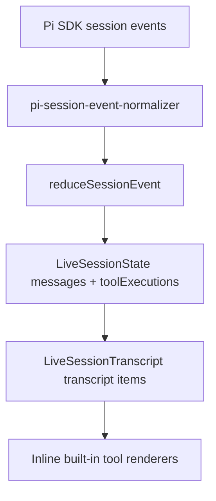

# Inline built-in tool UX equivalency design

## Status

Implemented, verified, and accepted.

## Goal

Render every built-in Pi tool inline in the Desktop transcript with the same information hierarchy as the CLI TUI.

The UX source of truth is the Pi CLI built-in tool renderer behavior for:

- `read`
- `bash`
- `edit`
- `write`
- `grep`
- `find`
- `ls`

Desktop must show these tool calls chronologically in the conversation transcript. Desktop must not show a separate tool-call timeline above the composer.

## Current state

Verified files:

- Built-in tool list: `<pi-mono-root>/packages/coding-agent/src/core/tools/index.ts`
- CLI tool renderers: `<pi-mono-root>/packages/coding-agent/src/core/tools/*.ts`
- CLI tool execution shell: `<pi-mono-root>/packages/coding-agent/src/modes/interactive/components/tool-execution.ts`
- Desktop transcript rendering: `src/renderer/components/live-session-transcript.tsx`
- Desktop generic tool rendering: `src/renderer/components/message-content.tsx`
- Desktop tool lifecycle state: `src/renderer/session/session-state.ts`
- Desktop event normalizer: `src/main/pi-session/pi-session-event-normalizer.ts`
- Redundant tool panel path: `src/renderer/components/chat-shell.tsx`, `src/renderer/components/coding-panel.tsx`, `src/renderer/components/tool-timeline.tsx`, `src/renderer/components/tool-timeline-item.tsx`

Current Desktop stores live tool execution state separately from transcript messages and renders it through `CodingPanel` below the transcript content, above the composer. That panel duplicates tool result messages and does not match the CLI transcript model.

Current Desktop renders `role === "tool"` messages with a generic `
` block. That loses the CLI's tool-specific hierarchy, such as `read <path>:<range>`, `$ <command>`, edit diffs, search summaries, and truncation notices.

## Constraints

- Pi owns tool execution semantics. Desktop only renders normalized tool events and transcript messages.
- Tool UI must stay inline in the transcript.
- The separate `CodingPanel` and `ToolTimeline` surface is out of scope for this equivalency slice.
- Built-in tools get dedicated renderers. Unknown or extension tools get a safe generic inline fallback.
- Large outputs must stay compact by default and expose an expand affordance.
- Renderer logic must tolerate missing, malformed, partial, or historical data.
- Provider secrets and sensitive payloads must not be exposed beyond the content Pi already emitted for the transcript/tool result.

## Out of scope

- Reimplementing Pi built-in tools.
- Adding a right-panel terminal, diff review workspace, or raw tool inspector.
- Full terminal theme parity with Pi TUI colors, borders, or keybinding hints.
- Extension tool-specific renderers beyond the generic fallback.
- Changing Pi SDK event contracts outside the Desktop normalizer boundary.

## Recommended approach

Use a transcript item model that merges assistant/user/system messages and tool executions into one ordered stream. Render that stream through an inline tool renderer registry.

This is preferred because it keeps Desktop aligned with CLI behavior, removes duplicate surfaces, and uses the existing normalized tool lifecycle events.

Alternatives considered:

- Keep `CodingPanel` and improve it. This preserves the rejected duplicate surface and does not meet CLI parity.
- Render only final `toolResult` messages with richer formatting. This misses running state, partial output, cancellation, and start-time invocation visibility.

## Architecture

### Transcript item model

Extend live session state so transcript rendering can order messages and tool executions from the same event stream.

Add metadata to live messages:

- `receivedAt`
- optional `toolCallId` for `toolResult` messages

Keep `LiveToolExecution` as the lifecycle state for tool calls:

- `id`
- `toolName`
- `status`
- `args`
- `partialResult`
- `result`
- `isError`
- `startedAt`
- `updatedAt`
- `endedAt`

Build transcript items at render time:

- message items from `session.messages`
- tool items from `session.toolExecutions`
- sorted by `receivedAt` or `startedAt`
- stable tie-breaker by insertion order when timestamps match

Suppress duplicate tool messages when:

- message role is `tool`
- message has a `toolCallId`
- a matching `LiveToolExecution` exists

For history that lacks tool lifecycle state, keep rendering `role === "tool"` messages with the generic fallback so old sessions remain readable.

### Event normalization

Update `pi-session-event-normalizer` so `toolResult` messages preserve `toolCallId` on normalized `message_start` and `message_end` events.

Update `PiSessionEventSchema` and `LiveSessionMessage` to carry the optional `toolCallId` and `receivedAt` fields.

The normalizer should keep the current `messageId` shape, including `toolResult:<toolCallId>:<stableId>`, for stable renderer keys.

### Inline tool renderer registry

Create a renderer boundary under `src/renderer/tools/inline-tool-renderers/` or an equivalent feature folder.

Suggested modules:

- `inline-tool-call.tsx`: shared shell and renderer dispatch
- `tool-renderer-types.ts`: typed renderer props and type guards
- `tool-payload.ts`: payload extraction helpers for `content`, `details`, text output, truncation data, and string args
- `read-tool-call.tsx`
- `bash-tool-call.tsx`
- `edit-tool-call.tsx`
- `write-tool-call.tsx`
- `grep-tool-call.tsx`
- `find-tool-call.tsx`
- `ls-tool-call.tsx`
- `generic-tool-call.tsx`

The shared shell owns:

- tool status style
- compact header layout
- expand/collapse behavior
- accessible labels
- error/canceled/running/completed state presentation
- safe output rendering with `<pre>` for plain text and diff/code blocks where needed

### Tool-specific rendering

`read`

- Header: `read <path>:<start-end>`.
- Collapsed body: compact preview or no body for compact resource reads when content is not useful by default.
- Expanded body: code/text preview with line limit and truncation notice.
- Image reads: show a compact image/file note based on emitted text or MIME fallback data.

`bash`

- Header: `$ <command>` with optional timeout.
- Running state: show live partial output when available.
- Completed state: show final output preview, duration when computable, and truncation/full-output notices.
- Failed state: show error styling and emitted error text such as exit code, timeout, or aborted message.
- Collapsed preview should favor the tail of command output, matching CLI behavior for long command output.

`edit`

- Header: `edit <path>`.
- Body: unified diff preview from `result.details.diff` when available.
- Failed state: show error text from tool result content.
- If no diff exists, show a concise success message from emitted text.

`write`

- Header: `write <path>`.
- Body: content preview from `args.content`, syntax-highlighted later only if this can reuse existing renderer utilities without adding complexity.
- Completed state: show concise success text only when useful.
- Failed state: show error output.

`grep`

- Header: `grep /<pattern>/ in <path>` with glob and limit metadata.
- Body: match list preview with file/line output.
- Warnings: match limit, byte truncation, and line truncation from `details`.

`find`

- Header: `find <pattern> in <path>` with limit metadata.
- Body: file path result preview.
- Warnings: result limit and byte truncation from `details`.

`ls`

- Header: `ls <path>` with limit metadata.
- Body: directory entry preview.
- Warnings: entry limit and byte truncation from `details`.

Generic fallback

- Header: `<toolName>` plus status.
- Body: concise input and output summaries.
- Expand: raw JSON-like args/result rendering with safe formatting.

## Component changes

- `src/renderer/components/chat-shell.tsx`
  - Remove `CodingPanel` import and render call.
  - Keep the scroll trigger aware of `session.toolExecutions` so live tool updates scroll correctly.

- `src/renderer/components/live-session-transcript.tsx`
  - Build and render transcript items instead of mapping only `session.messages`.
  - Render message items with `MessageContent`.
  - Render tool items with `InlineToolCall`.

- `src/renderer/components/message-content.tsx`
  - Remove built-in tool-specific responsibility from this component.
  - Keep fallback rendering for historical `role === "tool"` messages that cannot be associated with a tool execution.

- `src/renderer/components/coding-panel.tsx`
- `src/renderer/components/tool-timeline.tsx`
- `src/renderer/components/tool-timeline-item.tsx`
  - Delete after references are removed, unless a remaining test or future scope still imports them. If retained temporarily, they must not be reachable from product UI.

- `src/renderer/styles.css`
  - Remove `coding-panel` and `tool-timeline` styles once components are deleted.
  - Add inline transcript tool styles under the existing `live-session` section.

## Data flow

## Implementation phases

### Phase 1: Remove the duplicate panel

- Remove `CodingPanel` from `ChatShell`.
- Delete or orphan-check coding panel and timeline components, view models, tests, and styles.
- Update `ChatShell` tests to assert the tool timeline is absent.

Acceptance:

- No `.coding-panel` or `.tool-timeline` exists in rendered session UI.
- Tool lifecycle state still updates session state.

### Phase 2: Preserve tool identity on messages

- Add optional `toolCallId` and `receivedAt` to normalized message events and live messages.
- Populate `toolCallId` for Pi `toolResult` messages.
- Update session reducer tests for streaming, final, history, and tool result messages.

Acceptance:

- A `toolResult` message can be associated with its `LiveToolExecution`.
- Historical messages without tool identity still render.

### Phase 3: Merge transcript items

- Add transcript item builder with deterministic ordering.
- Suppress duplicate tool result messages when a matching tool execution exists.
- Keep grouped role-label behavior for regular messages.

Acceptance:

- Tool calls appear at their chronological position in the transcript.
- Tool result payloads do not appear as redundant extra transcript records when a richer tool item exists.

### Phase 4: Add built-in tool renderers

- Add shared inline shell and renderer registry.
- Implement renderers for `read`, `bash`, `edit`, `write`, `grep`, `find`, and `ls`.
- Add generic fallback.
- Add compact output helpers and expand controls.

Acceptance:

- Each built-in tool has a distinct inline treatment matching CLI information hierarchy.
- Unknown tools render safely.

### Phase 5: Polish and accessibility

- Add status text and accessible labels for running, completed, failed, and canceled.
- Validate keyboard access for expand/collapse controls.
- Keep output previews readable in narrow transcript widths.

Acceptance:

- Tool blocks remain compact and usable in Desktop's main chat column.
- Status is visible without relying on color alone.

### Phase 6: Verification and UAT

- Add unit tests for all built-in renderers.
- Add transcript merge and duplicate suppression tests.
- Run targeted renderer/session tests.
- Run `pnpm check` if the change set is ready for final verification.
- Capture UAT evidence with a session or fixture that exercises all 7 tools inline.

Acceptance:

- Tests pass.
- UAT evidence shows all 7 built-in tools inline.
- UAT evidence shows no separate tool timeline above the composer.

## Risks and mitigations

- Risk: SDK history may not include tool lifecycle events.
  - Mitigation: keep generic rendering for historical `role === "tool"` messages.

- Risk: timestamps from separate event types may tie or arrive close together.
  - Mitigation: preserve insertion order as a secondary sort key in transcript item construction.

- Risk: malformed tool payloads could crash renderer code.
  - Mitigation: use type guards and fall back to generic rendering.

- Risk: large outputs could make the transcript noisy.
  - Mitigation: default to concise previews with explicit expand controls.

- Risk: diff rendering for `edit` could become too broad.
  - Mitigation: initially render unified diff text with minimal classes, then refine if needed.

## Testing plan

- `tests/renderer/session-state.test.ts`
  - message metadata and tool identity preservation
  - running, completed, failed, canceled tool lifecycle states

- `tests/renderer/live-session-transcript.test.ts`
  - transcript merge order
  - duplicate suppression
  - historical tool message fallback

- New inline renderer tests
  - `read`, `bash`, `edit`, `write`, `grep`, `find`, `ls`
  - malformed payload fallback
  - expand/collapse affordance where implemented

- Removed panel tests
  - delete `coding-panel` tests if components are deleted
  - update `chat-shell` tests to assert no panel render

- Manual/UAT
  - start Desktop with a fixture or live session that triggers all 7 built-in tools
  - capture screenshot evidence for inline tool blocks
  - verify no timeline above composer

## Build handoff

Approved scope:

- Replace the separate Desktop tool timeline surface with inline transcript tool rendering.
- Cover all built-in Pi tools: `read`, `bash`, `edit`, `write`, `grep`, `find`, `ls`.
- Keep unknown tools readable through a generic inline fallback.

Non-goals:

- Right-panel terminal or diff workspace.
- Pi tool execution changes.
- Extension-specific tool renderer parity.
- TUI theme cloning.

Suggested build order:

1. Remove the product-visible `CodingPanel` path.
2. Add message metadata needed for tool association.
3. Build transcript item merging and duplicate suppression.
4. Add shared inline renderer shell and generic fallback.
5. Add built-in tool renderers in this order: `bash`, `read`, `edit`, `write`, `grep`, `find`, `ls`.
6. Add tests and UAT evidence.

Required verification:

- Focused renderer/session tests pass.
- `pnpm check` passes before merge readiness.
- UAT evidence demonstrates inline rendering for all 7 built-in tools and absence of the separate timeline.

## Build completion report

- Base SHA: `9d1107bc9f52ae1f673f8d7da9c0323918ddb492`
- Implementation commit: `3d2040be`
- Completed tasks:
  - Removed the product-visible `CodingPanel` and `ToolTimeline` path.
  - Preserved `toolCallId`, `receivedAt`, and renderer insertion `sequence` for session messages and tool executions.
  - Merged messages and tool executions into one transcript stream with duplicate tool-result suppression.
  - Added inline renderers for `bash`, `read`, `edit`, `write`, `grep`, `find`, `ls`, plus a generic fallback.
  - Added compact previews, expandable full output, status labels, and truncation/full-output warnings.
- Main files changed:
  - `src/renderer/components/live-session-transcript.tsx`
  - `src/renderer/tools/inline-tool-call.tsx`
  - `src/renderer/session/session-state.ts`
  - `src/main/pi-session/pi-session-event-normalizer.ts`
  - `src/shared/pi-session.ts`
  - `src/renderer/styles.css`
- Verification:
  - `pnpm vitest run tests/renderer/inline-tool-call.test.tsx tests/renderer/live-session-transcript.test.ts tests/renderer/chat-shell.test.ts tests/renderer/session-state.test.ts tests/renderer/app-session-scope.test.ts tests/main/pi-session-event-normalizer.test.ts tests/shared/pi-session.test.ts` passed, 102 tests.
  - `pnpm check` passed, including format, lint, typecheck, coverage tests, build, and smoke tests.
- Review gates:
  - TDD used for panel removal, metadata preservation, transcript merge, inline tool rendering, accessibility/preview behavior, warnings, and ordering fixes.
  - Independent reviewer subagent found no Critical or Important issues after final review.
- Approved deviations: none.
- Verify phase evidence: `uat-evidence/mixed-20260527-225300/evidence.md`
- UAT result: all slices passed; user accepted the verification.
- Known follow-up issues: none from implementation verification.
- Independent subagent review: used.
