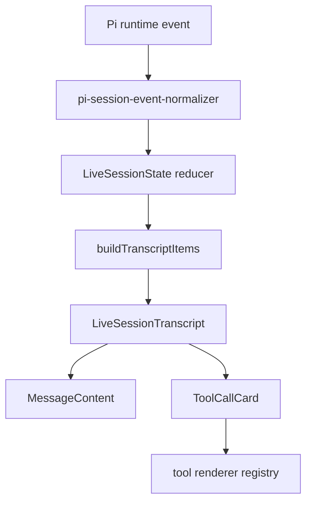

# Tool transcript rendering design

## Goal

Make Pi Desktop render tool activity as first-class inline transcript items, with consistent formatting for built-in Pi tools. Tool calls should appear in the conversation where they happened, not as a separate list above the composer.

The source of truth for tool semantics remains Pi. Desktop owns the transcript presentation, event ordering, duplicate suppression, and visual treatment.

## Source of truth

- User feedback screenshot, CLI reference: `/var/folders/d7/p8j2hgrd7b7c89fxsxlbwptm0000gn/T/orca-paste-1780410428950-7c387db2-f02b-4f4c-9784-17584f6f77ac.png`
- User feedback screenshot, Desktop current state: `/var/folders/d7/p8j2hgrd7b7c89fxsxlbwptm0000gn/T/orca-paste-1780410489671-38b4f34a-19a4-4454-9aab-d738c207874c.png`
- Pi CLI built-in tool renderers: `/Volumes/EVO/repos/pi-mono/packages/coding-agent/src/core/tools/`
- Pi CLI interactive renderer shell: `/Volumes/EVO/repos/pi-mono/packages/coding-agent/src/modes/interactive/components/tool-execution.ts`
- Existing parity records: `docs/specs/2026-05-25-cli-parity-source-inventory.md` and `docs/specs/2026-05-25-cli-parity-coverage-matrix.md`
- Roadmap observability goals: `docs/pi-desktop-high-level-roadmap.md`

## Verified current state

Current Desktop has two tool presentation paths:

- Inline `role === "tool"` messages render through `src/renderer/components/message-content.tsx` as generic collapsible text.
- `src/renderer/components/chat-shell.tsx` renders `CodingPanel`, which renders `ToolTimeline` and `ToolTimelineItem` from `session.toolExecutions` below the transcript and above the composer.

The separate timeline causes the reported list of tool calls above the composer. It also duplicates the transcript concept and uses generic summaries rather than tool-specific formatting.

Current runtime and renderer state already preserve structured tool execution data:

- `src/main/pi-session/pi-session-event-normalizer.ts` normalizes `tool_execution_start`, `tool_execution_update`, and `tool_execution_end` events.
- `src/renderer/session/session-state.ts` stores `LiveToolExecution` with `toolName`, `args`, `partialResult`, `result`, `isError`, and timestamps.
- Flattened `toolResult` messages still appear as transcript messages, which can create duplicate or low-information tool rows when structured execution data exists.

## Constraints

- Do not reimplement Pi tool execution semantics in Desktop.
- Do not make the right panel the primary fix for this issue. Inline transcript rendering is the required behavior.
- Keep this focused on presentation, ordering, and duplicate suppression. Settings, approvals, permissions, and extension management remain separate work.
- Use existing Pi event fields and serialized payloads. If required data is missing, fail visibly in the UI or test as blocked rather than guessing.
- Keep renderer boundaries explicit: transcript item construction, tool render models, React components, and styles should be separable.

## Approaches considered

### Approach A: remove the standalone timeline and keep generic tool messages

This fixes the above-composer list quickly, but it leaves Desktop with generic `Tool` rows like `# Workflow Reference` or `{`. It does not meet the CLI parity feedback.

### Approach B: keep the timeline and improve its formatting

This can make the timeline more readable, but the user requirement says tool calls should only appear inline. It would preserve the duplicate surface that caused the feedback.

### Approach C: add inline transcript items backed by structured tool executions

This removes the standalone timeline, interleaves tools with messages, and gives each built-in tool a renderer shaped by Pi CLI behavior. This is the recommended approach.

## Recommended design

Implement a transcript item view model that merges messages and structured tool executions into one ordered render list. `LiveSessionTranscript` should render transcript items, not just messages.

The tool item should use a renderer registry:

- `bash`
- `read`
- `grep`
- `find`
- `ls`
- `edit`
- `write`
- generic fallback for custom or unknown tools

Each renderer should produce a plain render model for a shared `ToolCallCard` component. The model should describe title, status, preview content, expandable details, and warnings. React components should not parse tool-specific payloads directly.

## Transcript ordering

Build should introduce a deterministic transcript item ordering path.

Preferred path:

1. Add `createdAt` and `updatedAt` to `LiveSessionMessage` when applying live events and history payloads.
2. Use `startedAt`, `updatedAt`, and `endedAt` from `LiveToolExecution` for tool items.
3. Add `buildTranscriptItems(session)` that returns a single ordered list.
4. Sort by event timestamp, with stable tie-breaking that preserves existing array order.

If adding timestamps to historical messages requires broad main-process changes, Build may use a narrower live-session solution first, provided tests prove inline tool ordering for live events and no standalone timeline remains.

## Duplicate suppression

When structured tool execution data exists for a `toolCallId`, Desktop should not render the matching flattened `toolResult` message as a separate transcript row.

Rules:

- Render the structured `LiveToolExecution` item.
- Suppress transcript messages whose IDs begin with `toolResult:<toolCallId>:` when the same `toolCallId` is present in `session.toolExecutions`.
- Continue to render unmatched `role === "tool"` messages with the generic fallback so history or malformed data remains visible.

## Tool rendering contract

All tool cards share these behaviors:

- Inline placement in the transcript flow.
- Compact default presentation.
- Expandable detail view for raw args and output.
- Visible status for running, completed, failed, and canceled.
- Error output visible without requiring the reviewer to inspect raw JSON.
- Long output preview with a visible truncation or expand hint.
- Monospace output where content is command output, file content, grep output, directory entries, JSON, or diffs.

### Built-in tool formatting

Use the Pi CLI renderers as the formatting baseline, adapted to Desktop UI.

- `bash`: title as `$ <command>` with timeout when present. Preview command output, show elapsed or completed duration when available, show exit or failure state, and show truncation or full-output notices when available.
- `read`: title as `read <path>` with `:start-end` when offset or limit is present. Preview file text with syntax-aware formatting when practical. Show image reads as a clear image/file placeholder or image preview if available.
- `grep`: title as `grep /<pattern>/ in <path>` with glob and limit details when present. Preview matching lines and show match-limit or truncation warnings.
- `find`: title as `find <pattern> in <path>` with limit details when present. Preview matched paths and show result-limit or truncation warnings.
- `ls`: title as `ls <path>` with limit details when present. Preview directory entries and show entry-limit or truncation warnings.
- `edit`: title as `edit <path>`. Show diff-oriented preview or result when `details.diff` is present. Show edit errors visibly.
- `write`: title as `write <path>`. Preview written content and show write errors visibly.
- unknown/custom tool: title as `<toolName>`, show compact args summary, status, raw input, and raw output.

## Component architecture

Suggested files:

- `src/renderer/session/transcript-items.ts`
  - owns `TranscriptItem` and `buildTranscriptItems`.
- `src/renderer/tools/tool-render-model.ts`
  - owns render model types and safe payload helpers.
- `src/renderer/tools/tool-renderers.ts`
  - owns built-in renderer registry and generic fallback.
- `src/renderer/components/tool-call-card.tsx`
  - shared inline card presentation.
- `src/renderer/components/live-session-transcript.tsx`
  - renders message and tool transcript items.
- `src/renderer/components/message-content.tsx`
  - keeps user, assistant, system, and unmatched tool fallback content.
- `src/renderer/styles.css`
  - removes obsolete timeline styles once no code uses them, and adds inline tool-card styles.

Likely removals or quarantined code:

- `src/renderer/components/coding-panel.tsx`
- `src/renderer/components/tool-timeline.tsx`
- `src/renderer/components/tool-timeline-item.tsx`
- `src/renderer/tools/tool-timeline-view-model.ts`

Build may keep small helper functions if they move into the new renderer boundary and tests cover them.

## Data flow

## Implementation phases

### Phase 1: remove the standalone timeline

- Remove `CodingPanel` from `ChatShell` default session layout.
- Keep transcript scroll behavior working when tool events update.
- Add a regression test that proves `.coding-panel` or `.tool-timeline` does not render in the chat session body.

### Phase 2: add inline transcript item rendering

- Add the transcript item view model.
- Render `LiveToolExecution` inline in `LiveSessionTranscript`.
- Suppress matching flattened `toolResult` messages when structured tool data exists.
- Add tests for ordering and duplicate suppression.

### Phase 3: add renderer registry and generic card

- Add `ToolCallCard` and a generic renderer.
- Render status, title, preview, expandable raw input, and expandable raw output.
- Add tests for running, completed, failed, and canceled tools.

### Phase 4: implement built-in tool renderers

Implement renderers in this order:

1. `bash`
2. `read`
3. `grep`
4. `edit`
5. `write`
6. `ls`
7. `find`

Add unit tests for each renderer title and representative preview.

### Phase 5: visual fixture and QA

Add a fixture or test scenario that includes all built-in tools, a custom tool, long output, a failed tool, and a running tool. Use it for screenshot or browser preview QA.

## Acceptance criteria

1. The default chat session body no longer renders a standalone `CodingPanel`, `ToolTimeline`, or list of tool calls above the composer.
2. Tool executions render inline in the transcript at the point they occur, using structured `LiveToolExecution` data rather than only flattened `role === "tool"` message text.
3. A tool execution with a matching `toolResult:<toolCallId>:` message appears once in the transcript, not once as a structured card and once as a flattened tool row.
4. Unmatched tool messages still render visibly through a generic fallback path.
5. `bash`, `read`, `grep`, `find`, `ls`, `edit`, and `write` each have a built-in renderer with a tested title format and at least one tested preview or detail behavior.
6. Running, completed, failed, and canceled tool states are visually distinguishable and represented in renderer tests.
7. Failed tools show an error summary or output without requiring the user to expand raw JSON.
8. Long outputs show a preview plus an expand or truncation affordance.
9. Renderer tests cover transcript item ordering, duplicate suppression, generic fallback rendering, and built-in renderer formatting.
10. Manual or browser-preview QA captures a transcript containing at least `read`, `grep`, `bash`, one failed tool, and one custom or unknown tool, with no separate above-composer tool list.
11. `pnpm format:check`, `pnpm lint`, `pnpm typecheck`, and targeted renderer tests pass before Build is considered complete. If full `pnpm check` is run, any unrelated failure must be documented with evidence.

## Out of scope

- Right-panel Terminal and Command Output implementation beyond preserving future linkage points.
- Tool approval or permission policy UI.
- Extension renderer registration UX.
- Full Pi TUI theme parity.
- Replacing Pi tool definitions or execution behavior.
- Rich history migration beyond what is necessary to keep existing resumed transcripts visible.

## Verification plan

Build should add or update tests near the current renderer/session test structure. Minimum checks:

- `buildTranscriptItems` orders message and tool items deterministically.
- Duplicate suppression hides matched `toolResult` rows.
- `ChatShell` does not render `CodingPanel` in session layout.
- Built-in renderers format titles and previews for representative payloads.
- `ToolCallCard` exposes status and expandable details accessibly.

Manual QA should run a web preview or equivalent fixture view and capture a screenshot of the transcript. The screenshot should show inline tool cards and the bottom composer without a separate list of tool calls above it.

## Risks and mitigations

- Risk: Pi event timestamps are not enough to reconstruct exact ordering for every historical transcript.
  - Mitigation: prioritize live event ordering and keep unmatched historical tool messages visible through fallback rendering.
- Risk: Tool payload shapes differ between built-in tools, history messages, and partial updates.
  - Mitigation: isolate payload parsing in renderer functions that treat unknown fields as absent and show raw details.
- Risk: Implementing all built-in renderers in one change becomes too large.
  - Mitigation: ship generic inline rendering first, then add built-ins in the listed order with tests per renderer.
- Risk: Removing `ToolTimeline` deletes useful inspection details.
  - Mitigation: move reusable summary/output helpers into the inline renderer boundary before deleting old files.

## Build handoff

Approved scope for Build:

1. Remove the default separate tool timeline from the chat session body.
2. Add inline structured tool execution rendering in the transcript.
3. Add duplicate suppression for matched `toolResult` rows.
4. Add generic and built-in renderers for Pi built-in tools.
5. Add deterministic tests and one visual QA path.

Non-goals for Build:

- Do not implement the M07D right-panel command output surface.
- Do not add tool permission policy UI.
- Do not alter Pi runtime tool execution semantics.

Required evidence for Build completion:

- Passing targeted tests for transcript item ordering, duplicate suppression, and renderer formatting.
- Passing `pnpm format:check`, `pnpm lint`, and `pnpm typecheck`.
- Screenshot or browser-preview evidence that tool calls are inline and no above-composer tool list remains.
