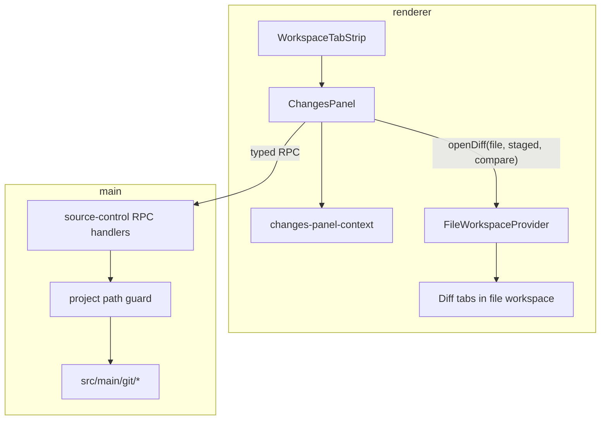

# Changes panel (Orca Source Control parity)

## Status

Implemented — Build completed on `feat/issue-144-m07c-changes-panel`; see `docs/specs/2026-06-07-changes-panel-build-report.md`.

## Goal

Replace the mock **Changes** right-panel tab with a live **Orca-equivalent Source Control** surface scoped to the selected Pi Desktop project. Users can inspect, stage, commit, sync, compare, and create GitHub pull requests from the Changes tab while chat remains active in the center column.

The **PR review tab** (Orca Checks panel: CI checks, comments, merge) is explicitly deferred to a follow-up milestone.

## Source of truth

- Orca Source Control reference: `/Volumes/EVO/repos/orca/src/renderer/src/components/right-sidebar/SourceControl.tsx` and supporting modules under `src/renderer/src/components/right-sidebar/`
- Orca git main process: `/Volumes/EVO/repos/orca/src/main/git/` and git IPC handlers in `/Volumes/EVO/repos/orca/src/main/ipc/filesystem.ts`
- Orca pure logic modules to port or adapt:
  - `source-control-tree.ts`
  - `source-control-primary-action.ts`
  - `source-control-dropdown-items.ts`
  - `useSourceControlSelection.ts`
  - `git-status-refresh.ts`
  - `source-control-discard-dialog.tsx`
  - `BulkActionBar.tsx`
  - `CommitArea` and related commit/PR composer exports from `SourceControl.tsx`
  - `CreatePullRequestDialog.tsx`
  - `CompareSummary.tsx`
- Pi Desktop right panel shell: `src/renderer/right-panel/`
- Pi Desktop file workspace (diff tab target): `src/renderer/file-workspace/`
- Pi Desktop project authority: `ProjectRecord.path` via `src/shared/project-state.ts`
- Existing git init helper: `src/main/projects/git.ts`
- Roadmap baseline: `docs/pi-desktop-high-level-roadmap.md` M07C (this spec supersedes the narrower M07C read-only diff scope)

## Verified current state

Pi Desktop today:

- The Changes tool tab uses `RightPanelKind = "diffs"` with mock data (`src/renderer/right-panel/diffs-panel-mock.tsx`, `right-panel-mock-data.ts`) that incorrectly mixes local change inspection with PR checks/review content.
- The workspace tab strip, add menu, and one-per-kind tool tab behavior already exist (`workspace-tool-tabs.tsx`, `right-panel-state.ts`).
- File workspace is live for explorer + editor tabs (`src/renderer/file-workspace/`); there is **no diff tab mode** yet.
- Git support is limited to `git init` on scratch project creation (`src/main/projects/git.ts`). No status/staging/commit/diff IPC exists.
- IPC pattern to follow: typed `workspaceFiles` RPC with Zod schemas (`src/shared/workspace-files.ts`, `src/main/workspace-files/`).

Orca today:

- Source Control and Checks are separate right-sidebar activity tabs.
- Source Control includes local git workflow **and** create/link hosted review (GitHub/GitLab) entry points.
- Checks owns PR review (checks list, threaded comments, merge/conflict triage).

## Constraints

- **GitHub only** for hosted review in this milestone (`gh` CLI/API). No GitLab MR (`glab`) support.
- **Local git only.** No Orca SSH runtime git (`connectionId`) paths.
- **Single selected project.** No multi-worktree polling or per-worktree sidebar state.
- **Project path confinement.** All git and filesystem operations must stay within `selectedProject.path`, using the same boundary discipline as `workspace-files` path guards.
- **Keep Pi as agent source of behavior** where Orca launches agents for prompts; adapt Orca UX but route generation/fix prompts through Pi Desktop session/composer patterns where practical.
- **Preserve existing right-panel tab model.** One Changes tool tab (icon strip), file tabs beside it, add menu, collapse/expand actions — do not adopt Orca's activity bar layout.
- **Renderer UI boundary:** use shadcn for dialogs, dropdowns, confirmations, and standard buttons per `docs/adr/0003-shadcn-ui-boundary.md`. Match pi-desktop tokens in `src/renderer/styles.css`.
- **Secrets stay in main.** Renderer receives operation results and metadata only; no tokens in renderer state.

## Out of scope

- PR review tab (Orca `ChecksPanel.tsx`): checks list, PR comments, merge button, conflict triage strip, comment composer.
- GitLab hosted review creation and MR headers.
- SSH / remote runtime git operations.
- Orca worktree model, repository settings panes, sparse checkout, ports panel.
- Monaco/CodeMirror diff editor; use pi-desktop file workspace diff presentation.
- Filesystem watcher-driven auto-refresh (manual refresh + polling while Changes active is sufficient for v1).
- Replacing inline transcript tool rendering or M07D terminal panel work.
- Web preview mock git state (`pnpm dev:web`); Changes is Electron-dev and test-verified only for v1.

## Approaches considered

### Approach A — Narrow M07C (read-only diffs)

Deliver changed-file list and readable diffs only. Smallest scope, but does **not** meet the approved goal of full Orca Changes parity.

### Approach B — Full Orca port including GitLab and SSH

Maximum parity with Orca's full platform surface. Rejected: pi-desktop is macOS-first with a single local project model; GitLab and SSH add large unrelated scope.

### Approach C — Orca Source Control port adapted to pi-desktop (recommended, approved)

Port Orca's git main modules and Source Control UI/logic, adapt identifiers from `worktreePath` to `projectId` + guarded `projectPath`, extend file workspace with diff tabs, and limit hosted review to GitHub. PR review tab follows in a separate milestone.

## Recommended design

### Tab and kind migration

- Rename `RightPanelKind` from `"diffs"` to `"changes"`.
- Update tool tab order, add menu, mock defaults, and tests accordingly.
- Replace `DiffsPanelMock` with `ChangesPanel` mounted from `right-panel-body.tsx` when `tab.kind === "changes"`.
- Remove PR checks/review mock sections from the Changes body (those belong in the future PR tab).

### Architecture

### Main process

Add `src/main/git/` by porting Orca's local git implementation (status, diff, stage/unstage/discard, bulk variants, commit, upstream, push/pull/sync/fetch/fast-forward, branch compare, conflict detection/abort, checkIgnored, history as needed).

Add `src/main/source-control/source-control-service.ts` that:

- Accepts `projectId` and resolves `projectRoot` through existing project service/state.
- Validates all relative paths against project root before invoking git commands.
- Uses `createGitChildProcessEnvironment()` from `src/main/projects/git.ts` for subprocess isolation.
- Returns typed payloads validated with Zod schemas in `src/shared/source-control/`.

Expose RPC operations through the existing transport (`src/shared/app-transport.ts`, preload) mirroring the `workspaceFiles` pattern. Minimum handler set:

| Operation | Purpose |
|---|---|
| `sourceControl.getStatus` | Working tree status |
| `sourceControl.checkIgnored` | Filter ignored paths for display |
| `sourceControl.stage` / `unstage` / `discard` | Single-path mutations |
| `sourceControl.bulkStage` / `bulkUnstage` / `bulkDiscard` | Bulk mutations |
| `sourceControl.getDiff` | File diff payload (text or binary) |
| `sourceControl.commit` | Create commit |
| `sourceControl.getUpstreamStatus` | Ahead/behind/unpublished |
| `sourceControl.push` / `pull` / `sync` / `fetch` / `fastForward` / `publish` / `rebaseFromBase` | Remote operations |
| `sourceControl.getBranchCompare` / `getBranchDiff` / `getCommitDiff` | Committed changes |
| `sourceControl.getConflictOperation` / `abortMerge` / `abortRebase` | Conflict state |
| `sourceControl.generateCommitMessage` | AI commit message draft |
| `sourceControl.createPullRequest` | GitHub PR creation via `gh` |
| `sourceControl.getPullRequestInfo` | Linked PR metadata for header |

Exact names may adjust during Build to match pi-desktop RPC conventions; behavior must cover the rows above.

### Renderer: Changes panel

Create `src/renderer/changes-panel/` (feature folder) containing ported/adapted Orca modules:

| Module | Responsibility |
|---|---|
| `ChangesPanel.tsx` | Panel shell composing tree, commit area, compare summary, headers |
| `changes-panel-context.tsx` | Status, upstream, selection, refresh, operation in-flight state |
| `use-git-status-polling.ts` | Poll while Changes tab active and project is git repo |
| `source-control-tree.tsx` | Tree rendering (port from Orca) |
| `source-control-selection.ts` | Selection helpers (port pure logic) |
| `CommitArea.tsx` | Commit message and delegates remote actions to `SourceControlActions` |
| `source-control-primary-action-resolver.ts` | Pure primary/dropdown action resolver (Orca parity; shipped Wave 1) |
| `BulkActionBar.tsx` | Bulk stage/unstage/discard (port) |
| `CompareSummary.tsx` | Branch compare header/toolbar (port) |
| `CreatePullRequestDialog.tsx` | GitHub-only create PR dialog (port, strip GitLab) |

Discard confirmation is inline in `ChangesPanel.tsx` via shadcn `AlertDialog` and `getDiscardConfirmation` (type-specific copy for untracked, added, deleted, and bulk paths).

Port pure logic from Orca with minimal changes:

- `source-control-primary-action-resolver.ts` (replaces separate Orca `source-control-primary-action.ts` + `source-control-dropdown-items.ts` modules)
- `source-control-tree.ts` (builder)
- `git-status-refresh.ts` (adapt to pi-desktop RPC)

Post-M07C follow-up for primary-action priority, diverged-branch sync blocking, and discard confirmations is tracked in `docs/specs/2026-06-08-orca-git-parity-roadmap.md` Wave 1 (shipped on `wave1`).

Restyle to pi-desktop CSS variables and shadcn primitives. Do **not** copy Orca Tailwind class strings wholesale where pi-desktop tokens differ.

### Renderer: diff tabs in file workspace

Extend file workspace tab model to support diff tabs opened from Changes:

- Tab identity includes project-relative path + diff context (`staged`, `unstaged`, branch compare id, etc.) following Orca's `openDiff` id strategy adapted to `projectId`.
- Tab presentation: filename + diff indicator; read-only diff view (unified or split — match Orca's default presentation closely).
- Text diff rendering with syntax-aware styling where practical; binary/large/unsupported/error states aligned with file workspace patterns.
- Opening a diff from Changes activates the file tab strip and selects the diff tab without losing Changes tool tab context.

### Primary action and dropdown parity

Port Orca's priority tables so the Changes commit header behaves the same way:

- **Stage All** when nothing staged but changes exist.
- **Commit** when staged changes and message present.
- **Push / Pull / Sync / Publish Branch / Create PR** based on upstream + staged/unstaged + hosted review eligibility.
- Dropdown includes commit variants, fetch, fast-forward, rebase-from-base, abort merge/rebase, create PR, publish, and destructive discard-all entries with the same enable/disable rules as Orca local-git mode.

Hosted review eligibility for **Create PR** uses GitHub remote detection and `gh auth status` (main process). When a PR is linked, show Orca-equivalent hosted review header link in Changes (title/state/open in browser) — not the full Checks panel.

### AI commit message

Port Orca's generate-commit-message flow with these adaptations:

- Default agent/provider path uses **Pi** where Orca used its agent catalog.
- Generation runs in main; renderer shows spinner, cancel, and error states in commit area.
- If Pi or `gh` prerequisites are missing, show visible actionable error copy (do not fail silently).

### Refresh and polling

- Manual refresh button in Changes header (Orca-equivalent).
- Poll every ~3s while Changes tab is active, selected project is available, and repo is git — coalesce in-flight requests like Orca.
- After mutating operations (stage, commit, push, etc.), refresh status and upstream promptly.

### Error handling

- Git not installed, not a repo, detached HEAD, upstream missing, auth failures, push rejected, commit hooks failing — all show visible panel or toast-level errors with human-readable messages ported from Orca's `resolveRemoteActionError` / commit failure summaries where applicable.
- Commit failure dialog with optional "fix with agent" prompt adapted to Pi composer/session launch.

## Resolved design decisions

Decisions from design interrogation (2026-06-07). Glossary terms live in `CONTEXT.md`.

| Topic | Decision |
|---|---|
| Tab kind | Rename `RightPanelKind` from `"diffs"` to `"changes"`. UI already labels the tool tab **Changes**. |
| PR review surface | Deferred **PR review** tab (Orca Checks) stays out of Changes; remove PR checks/review from the Changes mock body. |
| Diff tab model | Discriminated union in file workspace: `FileEditorTab \| FileDiffTab`. Do not overload `FileEditorTab`. |
| Diff tab IDs | Use `diff:` tab IDs (path + staged/unstaged/compare context). Extend workspace content-tab detection so diff tabs activate the file tab strip like editor tabs. |
| Diff presentation v1 | Inline/unified diff only in phase 5; no side-by-side toggle until polish if UAT shows a parity gap. |
| AI commit message | Main-process one-shot Pi SDK generation (fire-and-forget). Do not inject into the visible chat transcript. |
| AI PR fields | Include **Generate with AI** for Create PR title/body using the same main-process one-shot Pi path as commit messages (phase 7). |
| Commit failure recovery | Auto-submit a built recovery prompt to the active/resumed Pi session for the project, or to **project start** if no session exists; focus the chat column (Orca `submit-after-ready` parity). |
| Non-git empty state | Show **Initialize repository** using existing `initializeGitRepository`; refresh status after init. |
| Commit message drafts | In-memory only, keyed by `projectId`; clear after successful commit when draft still matches what was committed (Orca parity). |
| Web preview | Out of scope for v1 — no `dev-preview-api` git mocks; verify Changes in Electron dev and automated tests. |
| Roadmap M07C | Record decisions in this spec now; retitle/expand roadmap M07C when phase 2 lands. |

## Implementation phases

| Phase | Scope | Acceptance tie-in |
|---|---|---|
| **1 — Git foundation** | Port `src/main/git/*`, RPC schemas, path guard, `getStatus` + stage/unstage/discard + bulk | AC 1, 2, 10 |
| **2 — Changes shell** | Kind rename, `ChangesPanel`, status tree, refresh, empty/error/not-a-repo | AC 1, 11 |
| **3 — Commit workflow** | Commit area, drafts per project, commit RPC, failure dialog | AC 3, 9 |
| **4 — Remote workflow** | Upstream, push/pull/sync/fetch/fast-forward/publish/rebase | AC 4 |
| **5 — Diff tabs** | `getDiff`, file workspace diff tabs, open from tree | AC 5 |
| **6 — Branch compare** | Compare summary, branch/commit diff tabs | AC 6 |
| **7 — Create PR (GitHub)** | Dialog, `gh` create, header link | AC 7 |
| **8 — AI + conflicts + polish** | Generate commit message + PR fields, conflict abort/fix prompts, tests, roadmap note | AC 8, 9, 11, 12 |

Build should land phases in order; each phase should keep `pnpm check` green before starting the next.

## Testing and verification

- **Unit tests:** port/adapt Orca tests for `source-control-primary-action`, `source-control-dropdown-items`, `source-control-tree`, path guard, git status parsing.
- **Main tests:** git service operations against temp repos (mirror `tests/main/git.test.ts` and Orca git tests).
- **Renderer tests:** Changes panel empty/error states, stage/unstage refresh, commit enabled states, diff tab open hook.
- **Integration:** right-panel workspace test updated for `changes` kind; file workspace + diff tab flow.
- **Manual UAT:** select git project → stage file → commit → push (if remote configured) → open diff → create PR with authenticated `gh`.
- **Commands:** `pnpm format:check`, `pnpm lint`, `pnpm typecheck`, `pnpm test:coverage`, `pnpm check` (macOS).

## Risks and mitigations

| Risk | Mitigation |
|---|---|
| Large Orca port surface | Port pure logic first; split UI into feature folder; follow phased delivery |
| `SourceControl.tsx` god-file | Extract CommitArea/CompareSummary/PR composer as Orca already does; do not copy monolith wholesale into one file |
| Diff tab complexity | Start with unified text diff; add split view only if needed for parity |
| `gh` auth variability | Main-process probe with clear UI when unauthenticated; document in README troubleshooting |
| Roadmap M07C drift | Update `docs/pi-desktop-high-level-roadmap.md` M07C title/deliverables when Build completes phase 2 |

## Explicitly deferred work

- PR review tab (Orca Checks panel).
- GitLab MR creation and review.
- SSH/runtime git.
- Merge PR, review comments, CI triage UI.
- M07D terminal, M07E browser.

## Build handoff

**Approved scope:** Full Orca Source Control parity in the Changes right-panel tab for the selected local project, GitHub-only hosted review creation/linking, Pi-backed AI commit message generation.

**Non-goals:** PR review tab, GitLab, SSH git, Orca worktree/platform chrome.

**Ordered phases:** See Implementation phases table (1 → 8).

**Blocking questions:** None — design interrogation resolved decisions in table above.

**Key files (expected):**

- `src/main/git/` (new, ported)
- `src/main/source-control/` (new)
- `src/shared/source-control/` (new)
- `src/renderer/changes-panel/` (new)
- `src/renderer/file-workspace/` (extend for diff tabs)
- `src/renderer/right-panel/` (kind rename, body routing)
- `src/shared/app-transport.ts`, `src/preload/index.ts`
- `tests/main/source-control*.test.ts`, `tests/renderer/changes-panel*.test.tsx`

## Acceptance criteria

1. With a git-backed selected project, the Changes tab shows live staged, unstaged, and untracked sections matching repository state (not mock data).
2. User can stage, unstage, and discard individual files and multi-select bulk actions; the tree updates after operations without restarting the app.
3. User can enter a commit message, commit staged changes, and see explicit success feedback or a visible failure dialog with the error message.
4. The commit header primary button and dropdown expose Orca-equivalent local-git actions (stage all, commit, push, pull, sync, fetch, fast-forward, publish branch, rebase-from-base, abort merge/rebase) with correct enabled/disabled states derived from upstream and working tree metadata.
5. Selecting a changed file opens a diff tab in the file workspace; readable text diffs render inline; binary, too-large, and unsupported files show dedicated states instead of broken UI.
6. The branch compare / committed-changes section displays when compare metadata is available and opens branch or commit diff tabs consistent with Orca behavior.
7. For GitHub remotes with authenticated `gh`, user can create a pull request from Changes (title/body), receive success feedback, and see a linked PR header with open-in-browser affordance.
8. "Generate commit message" produces a draft in the commit message field using the Pi-backed generation path, or shows a visible error when prerequisites are missing.
9. In-progress merge or rebase states show visible badges; user can abort the operation from Changes; completed or failed operations surface visible feedback.
10. All git and path operations are rejected or confined to the selected project's root path; attempts outside the root fail safely in tests.
11. Changes refreshes on manual refresh and periodic polling while the Changes tab is active; git failures render a visible error state in the panel.
12. Chat, composer, file explorer/editor tabs, and other right-panel tool tabs continue to work; existing right-panel tests are updated; `pnpm check` passes on macOS.
