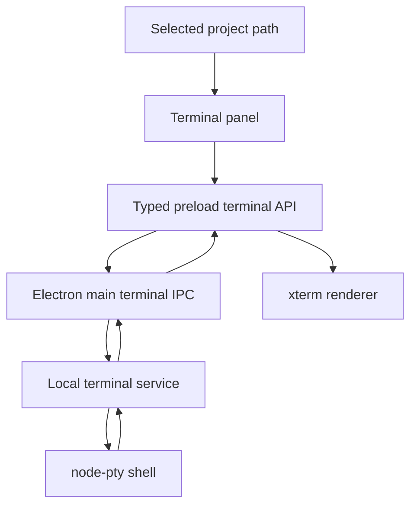

# M07D Right Panel Terminal Design

## Status

Draft for user review. Build starts only after explicit approval.

## Goal

Replace the right-panel Terminal mock with a real interactive local terminal for the selected Pi Desktop project.

The implementation should port or adapt Orca's terminal architecture where practical. Orca is an MIT-licensed Electron app with a mature cross-platform terminal stack. Pi Desktop should reuse that proven direction instead of designing a new terminal system from scratch, while trimming scope to Pi Desktop's selected-project model.

## Source of truth

- Product roadmap target: [Pi Desktop PRD and High-Level Roadmap](/pi-desktop-high-level-roadmap.md#current-planning-targets)
- Current right-panel mock: `src/renderer/right-panel/terminal-panel-mock.tsx`
- Current right-panel routing: `src/renderer/right-panel/right-panel-body.tsx`, `src/renderer/right-panel/right-panel-workspace.tsx`
- Current typed IPC/preload patterns: `src/shared/ipc.ts`, `src/shared/preload-api.ts`, `src/preload/index.ts`, `src/main/index.ts`
- Orca terminal references:
  - `/Volumes/EVO/repos/orca/package.json`
  - `/Volumes/EVO/repos/orca/src/main/providers/local-pty-provider.ts`
  - `/Volumes/EVO/repos/orca/src/main/ipc/pty.ts`
  - `/Volumes/EVO/repos/orca/src/renderer/src/components/terminal-pane/TerminalPane.tsx`
  - `/Volumes/EVO/repos/orca/src/renderer/src/components/terminal-pane/pty-transport.ts`
  - `/Volumes/EVO/repos/orca/src/renderer/src/components/terminal-pane/pty-connection.ts`
  - `/Volumes/EVO/repos/orca/src/renderer/src/components/terminal-pane/terminal-appearance.ts`
  - `/Volumes/EVO/repos/orca/docs/terminal-main-owned-state.md`

## Verified current state

Pi Desktop currently has a mock Terminal tab in the right panel. The mock renders static `cwd`, prompt, and output data through `TerminalPanelMock`. The right panel already supports tool tabs and routes the Terminal kind through `RightPanelBody`.

Pi Desktop also has established boundaries for main/preload/renderer IPC:

- shared Zod schemas and channel names in `src/shared/ipc.ts`
- renderer-safe preload API in `src/shared/preload-api.ts` and `src/preload/index.ts`
- main-process handler registration in `src/main/index.ts`
- project records with selected project paths from the app backend and renderer state

Pi Desktop does not yet include terminal dependencies such as `node-pty` or `@xterm/xterm`.

Orca uses `node-pty` for local PTY spawning and `@xterm/xterm` with xterm addons for renderer terminal UI. It also includes substantial additional systems for daemon providers, SSH/runtime routing, worktree terminal registries, split panes, mobile drivers, agent hooks, hidden-output recovery, and terminal persistence. Those systems should inform future work but are outside this first Pi Desktop milestone.

## Constraints

- Scope terminal sessions to the selected local project path.
- Keep the terminal backend in Electron main. Renderer code must not spawn shells or access arbitrary filesystem paths.
- Use typed IPC and preload boundaries consistent with existing Pi Desktop patterns.
- Preserve project path clarity. A terminal must visibly belong to the selected project.
- Surface terminal errors visibly. Do not silently fall back to a mock terminal.
- Port or adapt Orca implementation details when they fit, including lifecycle cleanup and xterm behavior.
- Preserve license attribution if substantial Orca source is copied into Pi Desktop.
- Keep the first build small enough to verify without importing Orca's full terminal platform.

## Out of scope

- SSH/runtime PTYs.
- Daemon-backed terminal provider and remote terminal multiplexing.
- Worktree terminal registries or multi-worktree terminal ownership.
- Split panes and terminal layout persistence.
- Host-owned snapshot recovery for hidden terminal output.
- Mobile terminal code.
- Agent hook/status overlays and titlebar extension injection.
- Command-output deep links from transcript tool rows.
- Ghostty or `libghostty` adoption.
- Full terminal settings UI.

## Recommended approach

Port an Orca-inspired local terminal stack into Pi Desktop:

1. Add `node-pty` for main-process PTY lifecycle.
2. Add `@xterm/xterm` and minimal xterm addons needed for fit and baseline rendering.
3. Create a Pi Desktop terminal service in main that owns spawn, write, resize, kill, exit, and cleanup.
4. Create typed terminal IPC schemas and preload methods/events.
5. Replace the right-panel terminal mock with an xterm-backed renderer panel.
6. Scope lifecycle to selected project and terminal tab activation.

This approach gives Pi Desktop a real terminal while leaving Orca-only complexity out of the first milestone.

## Architecture



### Main process

Add a terminal owner boundary, likely under `src/main/terminal/`.

Responsibilities:

- validate spawn requests
- resolve selected project cwd
- choose the default shell using Orca's local provider defaults as reference
- spawn local PTYs with `node-pty`
- track live terminal sessions by stable terminal session id
- write input to PTY
- resize PTY from renderer dimensions
- kill PTY on user request, project switch, app quit, or panel teardown
- emit data, exit, and error events to the renderer
- clean native listeners to avoid leaked callbacks

Use Orca `local-pty-provider.ts` as the implementation source for spawn defaults, environment setup, process cleanup, `onData`, `onExit`, and safe teardown patterns. Port only the local provider pieces needed for Pi Desktop.

### Shared IPC and preload

Add terminal schemas and channels near existing shared IPC definitions.

Likely terminal operations:

- `terminal.spawn`
- `terminal.write`
- `terminal.resize`
- `terminal.kill`
- `terminal.event`

Likely terminal event shapes:

- data: `{ type: "data", terminalId, data }`
- exit: `{ type: "exit", terminalId, code }`
- error: `{ type: "error", terminalId, message }`

The exact names can follow current Pi Desktop channel style. All payloads should use Zod schemas and renderer-safe result types.

### Renderer

Replace `TerminalPanelMock` with a feature-owned terminal panel, likely under `src/renderer/terminal/` or `src/renderer/right-panel/terminal-panel.tsx` plus helpers.

Responsibilities:

- render xterm inside the right panel
- spawn a terminal when the Terminal tab is active and a selected project exists
- show clear empty and unavailable states when no project is selected
- stream terminal data into xterm
- send user input to main via preload
- fit and resize xterm when the right panel resizes
- terminate the PTY from an explicit UI action and on required teardown
- show exited and error states visibly
- keep terminal state scoped to the selected project

Use Orca `TerminalPane.tsx`, `pty-transport.ts`, `pty-connection.ts`, and `terminal-appearance.ts` as references for xterm creation, input, resize, cleanup, paste/copy behavior, and visual treatment. Do not port the full pane manager or split-pane system for this milestone.

### Dependencies

Add the minimum dependencies for the first milestone:

- `node-pty`
- `@xterm/xterm`
- `@xterm/addon-fit`

Consider these only if needed during Build:

- `@xterm/addon-web-links`
- `@xterm/addon-search`
- `@xterm/addon-unicode11`
- `@xterm/addon-webgl`

Orca uses beta xterm packages and patches. Build should evaluate whether Pi Desktop can use stable package versions first. If the Orca beta/patch set is required for parity or Electron compatibility, document the reason in the Build report.

## Data flow

1. User opens or activates the Terminal tab for a selected project.
2. Renderer requests terminal spawn through preload with `projectId`, current `projectPath`, and initial cols/rows.
3. Main validates the project path against known project state, spawns a local PTY with `cwd = projectPath`, and returns a terminal id.
4. PTY output is emitted as terminal data events to the renderer.
5. Renderer writes data into xterm.
6. xterm user input is forwarded through preload to main, then written to the PTY.
7. xterm fit/resize changes send cols/rows to main, then main resizes the PTY.
8. Exit or kill events update the panel state and stop forwarding input.

## Error handling

Terminal errors must be visible in the right panel. Minimum states:

- no selected project
- missing or unavailable project path
- spawn failed
- terminal exited
- terminal backend unavailable
- write/resize/kill attempted for an unknown or exited terminal id

Main-process errors should return structured IPC failures or emit terminal error events. Renderer should avoid pretending a failed terminal is still live.

## Implementation phases

### Phase 1: Port local PTY backend

- Add terminal dependencies.
- Add terminal shared schemas and IPC channels.
- Add a main-process local terminal service based on Orca's `LocalPtyProvider` local-spawn subset.
- Register spawn, write, resize, kill, and app teardown cleanup.
- Add tests for spawn args, cwd, shell defaults where deterministic, write/resize/kill routing, and exit cleanup.

### Phase 2: Add preload terminal API

- Extend `PiDesktopApi` with a `terminal` namespace.
- Add safe invoke/event parsing in `src/preload/index.ts`.
- Keep renderer payloads narrow and typed.
- Add shared/preload tests if existing patterns support them.

### Phase 3: Replace Terminal mock with xterm panel

- Add a real terminal panel component.
- Import xterm CSS or integrate equivalent styles with `src/renderer/styles.css`.
- Use xterm lifecycle cleanup on unmount.
- Add input, paste, selection/copy, and data streaming.
- Add fit addon resize handling tied to the right-panel body.
- Keep project identity visible in panel chrome.

### Phase 4: Project scoping and lifecycle safety

- Spawn terminals only for the selected project.
- Stop or detach terminal state on project change according to the simplest safe behavior: kill the current PTY and show a new project-scoped terminal state.
- Do not reuse a PTY across projects.
- Handle tab close, right-panel collapse, and app quit without leaking PTYs.

### Phase 5: Verification and UAT

- Add targeted tests for backend, shared schemas, renderer state, and right-panel rendering.
- Run focused terminal tests plus repository checks.
- Manually verify a selected project terminal can run commands such as `pwd`, `ls`, and an interactive shell command, then terminate cleanly.

## Acceptance criteria

1. The right-panel Terminal tab replaces the current mock with a real interactive terminal.
2. Opening Terminal for a selected project spawns a local PTY shell with `cwd` set to the selected project path.
3. The renderer uses xterm-compatible terminal rendering and supports keyboard input, output streaming, selection/copy, paste, and basic terminal colors.
4. Terminal resize updates the PTY dimensions when the right panel changes size.
5. Users can start, view, and terminate a terminal session from the Terminal panel.
6. Terminal output, input, resize, and exit events flow through typed main/preload/renderer IPC boundaries.
7. Terminal errors surface visibly, including missing project path, PTY spawn failure, exited session, and unavailable terminal backend.
8. Terminal state is scoped to the selected project and does not leak across project switches.
9. The implementation ports/adapts Orca terminal code where practical, with source references recorded in the Build report.
10. Deferred scope is explicit: SSH/runtime PTYs, daemon recovery, worktree terminal registries, split panes, terminal persistence, command-output deep links, and Ghostty adoption are not part of this first M07D build.
11. Tests cover PTY spawn arguments, IPC validation, project cwd scoping, terminal lifecycle reducer/state, right-panel Terminal rendering, and error states.
12. Verification includes targeted tests plus `pnpm format:check`, `pnpm lint`, and `pnpm typecheck`.

## Testing and verification

Minimum automated checks for Build:

- main terminal service tests for spawn, write, resize, kill, exit, and cleanup
- IPC schema tests for valid and invalid terminal payloads
- renderer tests for no-project, starting, running, exited, and error states
- right-panel integration tests proving the Terminal tab renders the real panel instead of the mock
- project switch test proving terminal state does not leak between selected projects

Minimum manual UAT:

1. Open Pi Desktop with a selected project.
2. Open the Terminal tab.
3. Run `pwd` and verify it prints the selected project path.
4. Run `echo pi-desktop-terminal` and verify streamed output appears.
5. Resize the right panel and verify terminal layout remains usable.
6. Terminate the terminal and verify the panel shows an exited state.
7. Switch projects and verify the prior PTY does not continue in the new project terminal.

Final verification commands:

```bash
pnpm format:check
pnpm lint
pnpm typecheck
pnpm test -- --run <targeted terminal and right-panel tests>
```

If full `pnpm check` is not run, the Build report must state why and list the deterministic checks that were run.

## Risks and mitigations

- Risk: `node-pty` native install/build behavior complicates Electron packaging.
  - Mitigation: follow Orca's dependency and patch references when needed, and verify Electron dev plus typecheck early.
- Risk: porting Orca's full terminal stack creates too much scope.
  - Mitigation: port local PTY and xterm lifecycle only; keep daemon, SSH, worktree, split-pane, and mobile systems out of scope.
- Risk: hidden or background output grows unbounded.
  - Mitigation: first milestone may kill on project/tab teardown; host-owned recovery is deferred. If hidden output becomes a problem during Build, add a bounded data buffer and document snapshot recovery as follow-up.
- Risk: terminal keyboard and paste behavior has platform edge cases.
  - Mitigation: use Orca's terminal-pane helpers as source material and add focused tests for the behaviors ported.
- Risk: terminal state survives project switches incorrectly.
  - Mitigation: make project identity part of terminal spawn state and kill the active PTY on selected-project changes for this milestone.

## Explicitly deferred work

- `libghostty` and `ghostty-web` evaluation. Ghostty remains a potential future spike, but M07D should use Orca's `node-pty` plus xterm direction.
- Persistent terminal sessions across app restart.
- Terminal split panes and pane layout serialization.
- Search UI, web links, and advanced xterm addons unless required for the MVP.
- Terminal settings UI for shell, font, theme, scrollback, and profile selection.
- Agent-aware terminal hooks and status extraction.
- Integration between Pi session tool calls and the Terminal panel.

## Build handoff

Approved scope for Build after user approval:

1. Port/adapt Orca's local PTY and xterm terminal architecture into Pi Desktop.
2. Replace the right-panel Terminal mock with a selected-project local interactive terminal.
3. Keep the implementation bounded to one local PTY per Terminal tab/project context.
4. Add typed terminal IPC/preload contracts.
5. Add tests and UAT evidence for spawn, input/output, resize, kill, error states, and project scoping.

Non-goals for Build:

- Do not implement Orca daemon, SSH/runtime, mobile, split-pane, worktree registry, or agent-hook systems.
- Do not adopt Ghostty in this milestone.
- Do not build a terminal settings surface beyond minimal hardcoded defaults required for a functional terminal.

Required Build evidence:

- list of Orca source files referenced or ported
- dependency changes and any native-install notes
- changed files summary
- targeted tests and validation output
- manual UAT notes for `pwd`, streamed output, resize, kill, and project switch behavior
