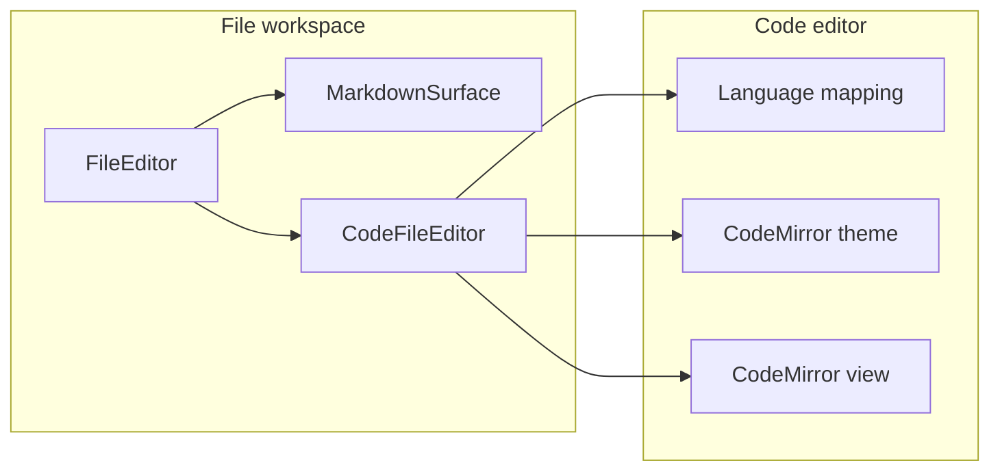

# Code File Editor Design

## Status

Implemented.

## Goal

Finish the File Explorer and Viewer work by replacing the plain non-Markdown text editor with an editable syntax-highlighted code surface for common file types. The result should make project files easier to inspect and lightly edit without turning Pi Desktop into a full IDE.

## Source of truth

- Prior file workspace spec: [`2026-05-22-m07b-right-panel-file-workspace.md`](./2026-05-22-m07b-right-panel-file-workspace.md)
- Markdown authoring spec: [`2026-05-24-world-class-markdown-support-design.md`](./2026-05-24-world-class-markdown-support-design.md)
- Renderer design boundary: [`../adr/0003-shadcn-ui-boundary.md`](../../adr/0003-shadcn-ui-boundary.md)
- Visual tokens: [`../../DESIGN.md`](../../../DESIGN.md) and `src/renderer/styles.css`

## Implemented state

- The right-panel file workspace opens project-scoped files through typed `workspaceFiles` IPC with path confinement.
- `src/renderer/file-workspace/file-editor.tsx` routes Markdown files to `MarkdownSurface` and all other supported text files to `CodeFileEditor`.
- Markdown source mode uses a CodeMirror-backed editor through `@mdxeditor/editor`.
- Product code declares direct CodeMirror dependencies for the packages imported by the generic code editor.
- `prismjs` remains available for read-only highlighting use cases.
- The main-process text file policy supports common source extensions such as `.ts`, `.tsx`, `.js`, `.jsx`, `.html`, `.css`, `.yml`, `.yaml`, `.rs`, `.py`, `.go`, `.sql`, and related config files.

## Requirements

- Replace the plain textarea for non-Markdown supported text files with a CodeMirror 6-backed editable code editor.
- Preserve the current Markdown surface, including Preview, Markdown, and Split modes.
- Support basic syntax highlighting for common file types, including TypeScript, JavaScript, HTML, CSS, JSON, YAML, Rust, Python, Go, shell, SQL, XML, and plain text fallback.
- Preserve current file workspace behavior for load states, dirty tracking, save, keyboard save, tab close prompts, project switch prompts, and path-confined persistence.
- Show useful language metadata in the editor or DOM for testing and future UI polish.
- Keep unsupported, binary, too-large, missing, and load-error states unchanged.
- Add direct dependencies for any CodeMirror packages imported by product code.

## Non-goals

- Full IDE features: LSP, IntelliSense, diagnostics, formatting, minimap, semantic highlighting, multi-cursor polish, or project-wide search.
- Replacing the Markdown rich editor or its source editor.
- Adding file create, rename, delete, move, or filesystem watching behavior.
- Expanding readable file support beyond the current text-file policy unless needed for the selected language coverage.
- Building custom syntax grammars.

## Recommended approach

Use CodeMirror 6 directly for non-Markdown text/code files.

This gives Pi Desktop an editable source surface with syntax highlighting, line numbers, selection, undo/redo, paste behavior, and find support through a mature editor package family. It also aligns with the existing Markdown work, where MDXEditor already uses CodeMirror for source editing and code blocks.

Product code should import CodeMirror packages directly and list them in `package.json`, even when the same versions already appear transitively through MDXEditor. Build should pin the minimum set required by the implementation.

### Alternatives considered

1. **CodeMirror 6 direct integration**
   - Best fit for editable code files and current product scope.
   - Keeps editor behavior focused and avoids IDE-level scope.
   - Requires direct dependency declarations and theme integration.

2. **Prism-highlighted preview plus textarea editing**
   - Uses an existing direct dependency.
   - Fits read-only rendering better than editable code.
   - Would create a weaker editing experience or require fragile overlay behavior.

3. **Reuse MDXEditor CodeMirror internals**
   - Reuses existing Markdown implementation details.
   - Couples generic file editing to Markdown editor internals.
   - Gives less control over generic code-file behavior and dependencies.

## Architecture

### Ownership boundaries

- `file-workspace` owns project selection, file tab state, dirty state, save behavior, blocked load states, and routing Markdown versus non-Markdown files.
- `markdown` owns rich Markdown editing and Markdown source/split behavior.
- `code-editor` owns CodeMirror integration for non-Markdown text/code files, language detection, base editor extensions, and Pi Desktop code editor theming.
- `workspaceFiles` IPC remains the only file persistence path.

## Suggested file map

| Area | Likely files |
| --- | --- |
| Dependencies | `package.json`, `pnpm-lock.yaml` |
| Code editor component | `src/renderer/code-editor/code-file-editor.tsx` |
| Language detection | `src/renderer/code-editor/code-language.ts` |
| CodeMirror theme/extensions | `src/renderer/code-editor/code-editor-theme.ts` |
| File workspace integration | `src/renderer/file-workspace/file-editor.tsx` |
| Styles | `src/renderer/styles.css` |
| Tests | `tests/renderer/code-language.test.ts`, `tests/renderer/code-file-editor.test.tsx`, existing file workspace tests as needed |

## UX design

For non-Markdown supported text/code files:

- Opening a file shows an editable highlighted code editor.
- The existing file viewer header keeps breadcrumbs, save menu, dirty state, save success, and save error messages.
- The editor shows line numbers and syntax highlighting when a known language is detected.
- Unknown supported text files use a plain text fallback in the same editor chrome.
- Read-only tabs render the editor in read-only mode.
- Edits update the active tab buffer, which keeps existing dirty-state and save behavior as the source of truth.
- `⌘S` / `Ctrl+S` continues to save through the existing file viewer handler.
- Markdown files continue to use the existing Markdown mode toggle and `MarkdownSurface`.
- Blocked states continue to use the existing file editor blocked UI.

## Language coverage

Initial mapping should cover:

- TypeScript and TSX: `.ts`, `.tsx`
- JavaScript and JSX: `.js`, `.jsx`, `.mjs`, `.cjs`
- HTML: `.html`, `.htm`
- CSS and SCSS: `.css`, `.scss`
- JSON and JSONC: `.json`, `.jsonc`
- YAML: `.yml`, `.yaml`
- Rust: `.rs`
- Python: `.py`
- Go: `.go`
- Shell: `.sh`, `.bash`, `.zsh`
- SQL: `.sql`
- XML: `.xml`
- Plain text/config fallback: `.txt`, `.env`, `.ini`, `.toml`, `.gitignore`, `.dockerignore`, `.editorconfig`, `.prettierrc`, `Makefile`, `Dockerfile`, `README`, `LICENSE`

The language mapping should return both a stable language id and a display label. Unknown supported text files should return `plain-text` and `Plain text`.

## Implementation phases

### Phase 1: Dependency and language policy

- Add direct CodeMirror dependencies for the packages imported by the code editor.
- Add language detection by extension and basename.
- Add unit coverage for known languages and plain text fallback.

Acceptance:

- Common source paths map to stable language ids and labels.
- Product imports do not rely on undeclared transitive dependencies.

### Phase 2: Code editor surface

- Add a `CodeFileEditor` component around CodeMirror 6.
- Configure line numbers, history, search/find support, read-only mode, wrapping behavior if needed, and language extension loading.
- Add a Pi Desktop dark theme that aligns with file workspace typography, colors, focus states, and selection treatment.
- Wire `value`, `relativePath`, `readOnly`, and `onChange` props.

Acceptance:

- The editor renders with language metadata for testability.
- Editing calls `onChange` with the new source content.
- Read-only mode blocks document changes.

### Phase 3: File workspace integration

- Route non-Markdown loaded text tabs from `FileEditor` to `CodeFileEditor`.
- Keep Markdown routing unchanged.
- Keep blocked states unchanged.
- Preserve the existing save menu, save status, dirty tracking, and keyboard save path.

Acceptance:

- TypeScript, YAML, Rust, and plain text files render through the code editor.
- Markdown files still render through `MarkdownSurface`.
- File workspace save and dirty behavior remains unchanged from the user's perspective.

### Phase 4: Verification and polish

- Add component tests for representative file types and edit/read-only behavior.
- Add regression coverage for Markdown routing.
- Run targeted tests during development, then `pnpm check` before Build completion.
- Perform a browser preview or desktop visual review focused on editor fit inside the right panel.

Acceptance:

- Targeted code editor and file workspace tests pass.
- `pnpm check` passes.
- Visual review confirms the editor fits the existing file viewer without clipping or unreadable contrast.

## Risks and mitigations

- **Dependency drift:** CodeMirror packages currently arrive transitively through MDXEditor. Add direct dependencies for every imported CodeMirror package.
- **Bundle size:** Import only the language packages needed for the initial coverage. Avoid broad language bundles unless Build proves the size is acceptable.
- **Theme mismatch:** Keep CodeMirror styling scoped under a feature class and use existing Pi Desktop CSS variables.
- **Editor update loops:** Treat the file tab buffer as the source of truth and update CodeMirror only when the incoming value differs from the current document.
- **Scope creep:** Keep IntelliSense, formatting, diagnostics, and project-wide code intelligence deferred.

## Testing and acceptance

Build is complete when:

- Non-Markdown supported text/code files open in an editable CodeMirror surface.
- TypeScript, JavaScript, HTML, CSS, JSON, YAML, Rust, Python, Go, shell, SQL, XML, and plain text fallback have deterministic language mapping.
- Editing a code file updates dirty state and saves through existing workspace file IPC.
- Read-only files remain non-editable.
- Markdown file behavior remains unchanged.
- Unsupported, binary, too-large, missing, and load-error states remain unchanged.
- Targeted tests and `pnpm check` pass.

## Explicitly deferred work

- IDE-grade language services.
- Formatting and lint diagnostics.
- Git diff gutters or changed-line decorations.
- Per-language editor preferences.
- Large-file streaming or virtualized document editing.
- Additional binary/media/document previewers.

## Build handoff

Implemented design direction used for the build:

1. Implement CodeMirror 6 as the generic non-Markdown code editor.
2. Declare direct CodeMirror dependencies for imported packages.
3. Add language mapping and tests before integrating into the file workspace.
4. Replace only the plain textarea path in `FileEditor`.
5. Preserve Markdown, save, dirty-state, tab, IPC, and blocked-state behavior.
6. Verify with targeted tests, a visual review, and `pnpm check`.

## Build completion report

- Spec path: `docs/specs/2026-05-24-code-file-editor-design.md`
- Base SHA: `67ffadd9e0dede0c582b3144b47fe815489e30e2`
- Implementation commit SHA: `f5ed7c704b7501ebb83f65ab7f0a90afd21fe1b9`
- Final branch head SHA: recorded in the Build completion response because the committed report cannot self-reference its own resulting SHA.
- Tasks completed:
  - Added direct CodeMirror dependencies used by product code.
  - Added deterministic code language detection and coverage.
  - Added a CodeMirror-backed `CodeFileEditor` with metadata, edit propagation, read-only handling, search/history/keymap support, line numbers, and Pi Desktop styling.
  - Routed non-Markdown file workspace tabs through `CodeFileEditor` while preserving Markdown and blocked-state routing.
  - Updated file workspace regression tests for dirty close and Cmd+S save behavior.
- Files changed:
  - `package.json`
  - `pnpm-lock.yaml`
  - `src/renderer/code-editor/code-editor-theme.ts`
  - `src/renderer/code-editor/code-file-editor.tsx`
  - `src/renderer/code-editor/code-language.ts`
  - `src/renderer/file-workspace/file-editor.tsx`
  - `src/renderer/styles.css`
  - `tests/renderer/code-file-editor.test.tsx`
  - `tests/renderer/code-language.test.ts`
  - `tests/renderer/file-editor-routing.test.tsx`
  - `tests/renderer/file-workspace-interactions.test.tsx`
  - `tests/renderer/file-workspace-panel.test.tsx`
- Tests and verification:
  - `pnpm test tests/renderer/code-language.test.ts tests/renderer/code-file-editor.test.tsx tests/renderer/file-editor-routing.test.tsx tests/renderer/file-workspace-interactions.test.tsx`
  - `pnpm test tests/renderer/file-workspace-panel.test.tsx`
  - `pnpm check`
  - Browser preview at `http://127.0.0.1:5174/`
- Review gates completed:
  - Spec compliance review: PASS.
  - Code quality review: PASS after removing dead textarea CSS.
  - Final whole-branch review: PASS.
- Approved deviations:
  - Built from a `Draft pending user review` spec by explicit user build request.
- Known follow-up issues:
  - None.
- Independent subagent review used: Yes.
